TODO list:

* Have we included the adults in AQUAMAT (eg Mozambique)? Need to check data merging with clincal dataset
* Problems with the SMAC dataset - some of the readings are weird, especially Gabon


# Systemativ review


```r
sysreview=read.csv('~/Dropbox/Apps/Overleaf/Pigment_Prognosis_Severe_Malaria/SystematicReview/All_Identified_papers_merged.csv')
table(sysreview$Screening.pass)
```

```
## 
##  No Yes 
## 183  19
```

```r
table(sysreview$ReasonExclude)
```

```
## 
##                                     Case report                Chickens 
##                      19                      12                       1 
##              Commentary                 Culture              Duplicated 
##                       1                      33                       3 
##                 Ex vivo        Fatal cases only                In vitro 
##                       2                       6                      15 
##                    Mice                  Monkey          Not falciparum 
##                      35                       3                       7 
##      Not severe malaria    Pigment not measured                 Puffins 
##                      25                      12                       1 
##                  Rabbit           Retrospective                  Review 
##                       1                       2                      23 
## Subcutanaeous not blood 
##                       1
```

```r
sum(sysreview$N..Severe.malaria.[sysreview$Screening.pass=='Yes'])
```

```
## [1] 27958
```

```r
median(sysreview$N..Severe.malaria.[sysreview$Screening.pass=='Yes'])
```

```
## [1] 67
```

```r
range(sysreview$N..Severe.malaria.[sysreview$Screening.pass=='Yes'])
```

```
## [1]    22 26296
```


# Data


```r
load('RData/Merged_pigment_data.RData')
pigmt_data$meta_code = apply(pigmt_data[, c('study','country')], 1, 
                             function(x) paste(x[1],x[2],sep=': '))
table(pigmt_data$study)
```

```
## 
##         AQ    AQUAMAT Lyke et al  SEAQUAMAT       SMAC 
##        560       5425        172       1461      26235
```

```r
# remove patients without an outcome variable
pigmt_data = filter(pigmt_data, !is.na(outcome))

my_cols_AQ = brewer.pal(n=9, name = 'Paired')
my_cols_SQ = brewer.pal(n=4, name = 'Accent')
my_cols_SMAC = brewer.pal(n=6, name = 'Set1')

aqViet_ind = pigmt_data$study == 'AQ'  
aq_ind = pigmt_data$study == 'AQUAMAT'  
sq_ind = pigmt_data$study == 'SEAQUAMAT'
smac_ind = pigmt_data$study == 'SMAC'
lyke_ind = pigmt_data$study == 'Lyke et al'

pigmt_data$site_f = as.factor(pigmt_data$site)
pigmt_data$country_f = as.factor(pigmt_data$country)
pigmt_data$study_f = as.factor(pigmt_data$study)

pigmt_data$prop_pigneut = pigmt_data$pig_neut/pigmt_data$pig_neut_denom
pigmt_data$prop_pigmono = pigmt_data$pig_mono/pigmt_data$pig_mono_denom

writeLines('Available PMN data:')
```

```
## Available PMN data:
```

```r
table(pigmt_data$study, !is.na(pigmt_data$pig_neut))
```

```
##             
##              FALSE  TRUE
##   AQ            77   483
##   AQUAMAT     1214  4211
##   Lyke et al     6   166
##   SEAQUAMAT    128  1333
##   SMAC          96 25845
```

```r
writeLines('Available PMM data:')
```

```
## Available PMM data:
```

```r
table(pigmt_data$study, !is.na(pigmt_data$pig_mono))
```

```
##             
##              FALSE  TRUE
##   AQ           259   301
##   AQUAMAT     1239  4186
##   Lyke et al     6   166
##   SEAQUAMAT    129  1332
##   SMAC         916 25025
```

```r
writeLines('Available parasite count data:')
```

```
## Available parasite count data:
```

```r
table(pigmt_data$study, !is.na(pigmt_data$parasitaemia))
```

```
##             
##              FALSE  TRUE
##   AQ             0   560
##   AQUAMAT      639  4786
##   Lyke et al     0   172
##   SEAQUAMAT      0  1461
##   SMAC          31 25910
```


parameters for Box-Cox transformation

```r
lambda_para = 50
lambda_pigment = 0.5/100
pigmt_data$lambda_para=lambda_para
pigmt_data$lambda_pigment=lambda_pigment
```


## Assess bias in data availibility

Availability of pigment data: is there a bias related to death? And related to parasitaemia?


```r
mod_death_AQ=
  glmer(outcome ~ as.numeric(!is.na(pig_neut))+(1|site:country_f), 
        family='binomial',
        data = pigmt_data[aq_ind,])
summary(mod_death_AQ)$coefficients
```

```
##                                Estimate Std. Error    z value     Pr(>|z|)
## (Intercept)                  -2.3042322  0.1674649 -13.759492 4.466553e-43
## as.numeric(!is.na(pig_neut)) -0.1292729  0.1145053  -1.128969 2.589110e-01
```

```r
mod_death_SQ=
  glmer(outcome ~ as.numeric(!is.na(pig_neut))+(1|site:country_f),
        family='binomial',
        data = pigmt_data[sq_ind,])
summary(mod_death_SQ)$coefficients
```

```
##                                Estimate Std. Error    z value     Pr(>|z|)
## (Intercept)                  -1.9418980  0.3183736 -6.0994322 1.064459e-09
## as.numeric(!is.na(pig_neut))  0.2560062  0.2653230  0.9648849 3.346025e-01
```

```r
mod_para_AQ =
  glmer(as.numeric(!is.na(pig_neut)) ~ log10(parasitaemia+lambda_para)+
          (1|site:country_f), 
        family='binomial',
        data = pigmt_data[aq_ind,])
summary(mod_para_AQ)$coefficients
```

```
##                                     Estimate Std. Error   z value     Pr(>|z|)
## (Intercept)                       -1.9576671 0.40784154 -4.800068 1.586119e-06
## log10(parasitaemia + lambda_para)  0.8245222 0.04590167 17.962794 3.811336e-72
```

```r
mod_para_SQ = 
  glm(as.numeric(!is.na(pig_neut)) ~ log10(parasitaemia+lambda_para) +
        country_f,
      family='binomial',
      data = pigmt_data[sq_ind,])
summary(mod_para_SQ)$coefficients
```

```
##                                     Estimate Std. Error   z value     Pr(>|z|)
## (Intercept)                        0.6297328 0.36391621  1.730433 8.355287e-02
## log10(parasitaemia + lambda_para)  0.3717608 0.07815339  4.756809 1.966770e-06
## country_fIndia                     0.5375038 0.40031095  1.342716 1.793640e-01
## country_fIndonesia                -0.7583936 0.22341400 -3.394566 6.873742e-04
## country_fMyanmar                   1.0715903 0.26961268  3.974555 7.051107e-05
```

```r
mod_para = 
  glmer(as.numeric(!is.na(pig_neut)) ~ log10(parasitaemia+lambda_para) +
          (1|site:country_f:study),
        family='binomial',
        data = pigmt_data[sq_ind|aq_ind,])
summary(mod_para)$coefficients
```

```
##                                     Estimate Std. Error   z value     Pr(>|z|)
## (Intercept)                       -0.5697068 0.36384541 -1.565794 1.173969e-01
## log10(parasitaemia + lambda_para)  0.7025905 0.03897889 18.024900 1.242372e-72
```

```r
par(las = 1, family='serif', mfrow=c(1,2))
hist(log10(pigmt_data$parasitaemia+lambda_para)[sq_ind], freq = F,
     breaks = seq(0,7,by=.5), main = 'SEAQUAMAT', xaxt='n', yaxt='n',
     xlab = 'Parasitaemia on admission', ylab='',ylim=c(0,.6))
axis(1, at = 2:6, labels = c(expression(10^2),
                             expression(10^3),
                             expression(10^4),
                             expression(10^5),
                             expression(10^6)))

ind_na = is.na(pigmt_data$pig_neut)
lines(density(log10(pigmt_data$parasitaemia+lambda_para)[ind_na&sq_ind],
              na.rm = T),lwd=3,col='blue')
lines(density(log10(pigmt_data$parasitaemia+lambda_para)[!ind_na&sq_ind],
              na.rm = T),lwd=3, col='red',lty=2)
legend('topleft', legend = c('Readable','Not readable'),
       inset = 0.03, col = c('red','blue'),lwd=3,lty=c(2,1))


hist(log10(pigmt_data$parasitaemia+lambda_para)[aq_ind], freq = F,
     breaks = seq(0,7,by=.5), main = 'AQUAMAT', xaxt='n', yaxt='n',
     xlab = 'Parasitaemia on admission', ylab='',ylim=c(0,.6))
axis(1, at = 2:6, labels = c(expression(10^2),
                             expression(10^3),
                             expression(10^4),
                             expression(10^5),
                             expression(10^6)))

ind_na = is.na(pigmt_data$pig_neut)
lines(density(log10(pigmt_data$parasitaemia+lambda_para)[ind_na&aq_ind],
              na.rm = T),lwd=3,col='blue')
lines(density(log10(pigmt_data$parasitaemia+lambda_para)[!ind_na&aq_ind],
              na.rm = T),lwd=3, col='red',lty=2)
legend('topleft', legend = c('Readable','Not readable'),
       inset = 0.03, col = c('red','blue'),lwd=3,lty=c(2,1))
```

<!-- -->

```r
table(high_para=pigmt_data$parasitaemia[aq_ind|sq_ind] > 10000, 
      available=!is.na(pigmt_data$pig_neut[aq_ind|sq_ind]))
```

```
##          available
## high_para FALSE TRUE
##     FALSE   411 1010
##     TRUE    540 4286
```

## Overall summaries of data

Data summaries

```r
xx=aggregate(outcome ~ meta_code, pigmt_data, mean)
xx$outcome = round(xx$outcome*100,1)
print(xx)
```

```
##                   meta_code outcome
## 1               AQ: Vietnam    14.8
## 2              AQUAMAT: DRC     4.3
## 3            AQUAMAT: Ghana     4.8
## 4            AQUAMAT: Kenya    10.0
## 5       AQUAMAT: Mozambique    11.3
## 6          AQUAMAT: Nigeria     9.1
## 7           AQUAMAT: Rwanda     5.2
## 8         AQUAMAT: Tanzania    14.4
## 9       AQUAMAT: The Gambia    11.0
## 10          AQUAMAT: Uganda     6.3
## 11         Lyke et al: Mali     8.7
## 12    SEAQUAMAT: Bangladesh    28.0
## 13         SEAQUAMAT: India    23.9
## 14     SEAQUAMAT: Indonesia     9.3
## 15       SEAQUAMAT: Myanmar    14.4
## 16  SMAC: Gabon (Lambarene)     1.4
## 17 SMAC: Gabon (Libreville)     5.1
## 18              SMAC: Ghana     4.6
## 19              SMAC: Kenya     3.6
## 20             SMAC: Malawi     2.6
## 21         SMAC: The Gambia     9.4
```

```r
xx=aggregate(age ~ study, pigmt_data, quantile, probs=c(0,.5,1))
xx$age = round(xx$age,1)
rownames(xx$age)=xx$study
print(xx$age)
```

```
##              0%  50% 100%
## AQ         15.0 30.0 79.0
## AQUAMAT     0.0  2.0 14.0
## Lyke et al  0.2  2.5 10.4
## SEAQUAMAT   2.0 25.0 87.0
## SMAC        0.0  2.2 15.0
```

```r
xx=aggregate(coma ~ study, pigmt_data, mean)
xx$coma = round(xx$coma*100)
print(xx)
```

```
##        study coma
## 1         AQ   52
## 2    AQUAMAT   36
## 3 Lyke et al   21
## 4  SEAQUAMAT   43
## 5       SMAC    9
```

```r
xx=aggregate(prop_pigneut ~ study, pigmt_data, function(x) sum(!is.na(x)))
print(xx)
```

```
##        study prop_pigneut
## 1         AQ          483
## 2    AQUAMAT         4211
## 3 Lyke et al          166
## 4  SEAQUAMAT         1333
## 5       SMAC        25845
```

```r
xx=aggregate(prop_pigmono ~ study, pigmt_data, function(x) sum(!is.na(x)))
print(xx)
```

```
##        study prop_pigmono
## 1         AQ          301
## 2    AQUAMAT         4186
## 3 Lyke et al          166
## 4  SEAQUAMAT         1332
## 5       SMAC        25025
```

```r
xx=aggregate(parasitaemia ~ study, pigmt_data, function(x) sum(!is.na(x)))
print(xx)
```

```
##        study parasitaemia
## 1         AQ          560
## 2    AQUAMAT         4786
## 3 Lyke et al          172
## 4  SEAQUAMAT         1461
## 5       SMAC        25910
```

```r
xx=aggregate(outcome ~ meta_code, pigmt_data[!is.na(pigmt_data$pig_neut),], mean)
xx$outcome = round(xx$outcome*100,1)
print(xx)
```

```
##                   meta_code outcome
## 1               AQ: Vietnam    13.7
## 2              AQUAMAT: DRC     4.0
## 3            AQUAMAT: Ghana     4.1
## 4            AQUAMAT: Kenya    11.9
## 5       AQUAMAT: Mozambique     9.5
## 6          AQUAMAT: Nigeria    10.9
## 7           AQUAMAT: Rwanda     5.9
## 8         AQUAMAT: Tanzania    14.0
## 9       AQUAMAT: The Gambia    10.5
## 10          AQUAMAT: Uganda     5.6
## 11         Lyke et al: Mali     9.0
## 12    SEAQUAMAT: Bangladesh    27.8
## 13         SEAQUAMAT: India    23.9
## 14     SEAQUAMAT: Indonesia    10.2
## 15       SEAQUAMAT: Myanmar    14.8
## 16  SMAC: Gabon (Lambarene)     1.4
## 17 SMAC: Gabon (Libreville)     5.1
## 18              SMAC: Ghana     4.6
## 19              SMAC: Kenya     3.6
## 20             SMAC: Malawi     2.6
## 21         SMAC: The Gambia     9.5
```

```r
writeLines(sprintf('We have data on pigmented neutrophil counts in %s patients', sum(!is.na(pigmt_data$pig_neut))))
```

```
## We have data on pigmented neutrophil counts in 32038 patients
```

```r
writeLines(sprintf('We have data on pigmented monocyte counts in %s patients', sum(!is.na(pigmt_data$pig_mono))))
```

```
## We have data on pigmented monocyte counts in 31010 patients
```

```r
writeLines('Median pigmented neutrophil count by country and study:')
```

```
## Median pigmented neutrophil count by country and study:
```

```r
aggregate(pig_neut ~ meta_code, data = pigmt_data, FUN = median)
```

```
##                   meta_code pig_neut
## 1               AQ: Vietnam        2
## 2              AQUAMAT: DRC        2
## 3            AQUAMAT: Ghana        3
## 4            AQUAMAT: Kenya        4
## 5       AQUAMAT: Mozambique        2
## 6          AQUAMAT: Nigeria        2
## 7           AQUAMAT: Rwanda        2
## 8         AQUAMAT: Tanzania        3
## 9       AQUAMAT: The Gambia        2
## 10          AQUAMAT: Uganda        1
## 11         Lyke et al: Mali        3
## 12    SEAQUAMAT: Bangladesh        4
## 13         SEAQUAMAT: India        3
## 14     SEAQUAMAT: Indonesia        0
## 15       SEAQUAMAT: Myanmar        4
## 16  SMAC: Gabon (Lambarene)        1
## 17 SMAC: Gabon (Libreville)        2
## 18              SMAC: Ghana        0
## 19              SMAC: Kenya        0
## 20             SMAC: Malawi        0
## 21         SMAC: The Gambia        0
```

```r
writeLines('Median pigmented monocyte count by country and study:')
```

```
## Median pigmented monocyte count by country and study:
```

```r
aggregate(pig_mono ~ meta_code, data = pigmt_data, FUN = median)
```

```
##                   meta_code pig_mono
## 1               AQ: Vietnam      4.0
## 2              AQUAMAT: DRC      4.0
## 3            AQUAMAT: Ghana      3.0
## 4            AQUAMAT: Kenya      3.0
## 5       AQUAMAT: Mozambique      1.0
## 6          AQUAMAT: Nigeria      2.0
## 7           AQUAMAT: Rwanda      1.0
## 8         AQUAMAT: Tanzania      2.0
## 9       AQUAMAT: The Gambia      2.0
## 10          AQUAMAT: Uganda      1.0
## 11         Lyke et al: Mali      3.0
## 12    SEAQUAMAT: Bangladesh      1.0
## 13         SEAQUAMAT: India      1.0
## 14     SEAQUAMAT: Indonesia      0.0
## 15       SEAQUAMAT: Myanmar      1.0
## 16  SMAC: Gabon (Lambarene)      3.0
## 17 SMAC: Gabon (Libreville)      4.5
## 18              SMAC: Ghana      4.0
## 19              SMAC: Kenya      1.0
## 20             SMAC: Malawi      1.0
## 21         SMAC: The Gambia      5.0
```


Some data plots

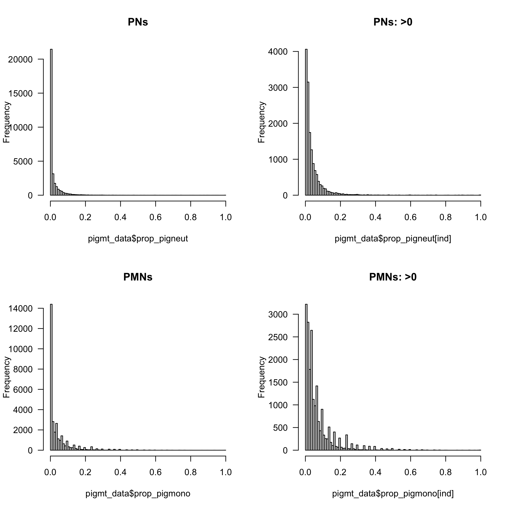<!-- --><!-- -->


# Prognostic value of parasite counts, PNs and PMs in AQUAMAT and SEAQUAMAT


## Overall prognostic value

We use generalised additive models as the effects may be non-linear


```
## [1] 0.02994212 0.00000000
```

```
## [1] 0 0
```

```
## [1] 1.023784e-06 0.000000e+00
```

```
## [1] 0.000000e+00 4.172026e-06
```

```
## [1] 0.02535501 0.00000000
```

```
## [1] 1.100682e-06 0.000000e+00
```


```
## Warning in predict.gam(mod_PCT_SQ, newdata = data.frame(parasitaemia = 10^xs, :
## factor levels 0 not in original fit
```

```
## Warning in predict.gam(mod_PCT_AQ, newdata = data.frame(parasitaemia = 10^xs, :
## factor levels 0 not in original fit
```

```
## Warning in predict.gam(mod_PN_SQ, newdata = data.frame(prop_pigneut = xs, :
## factor levels 0 not in original fit
```

```
## Warning in predict.gam(mod_PN_AQ, newdata = data.frame(prop_pigneut = xs, :
## factor levels 0 not in original fit
```

```
## Warning in predict.gam(mod_PM_SQ, newdata = data.frame(prop_pigmono = xs, :
## factor levels 0 not in original fit
```

```
## Warning in predict.gam(mod_PM_AQ, newdata = data.frame(prop_pigmono = xs, :
## factor levels 0 not in original fit
```

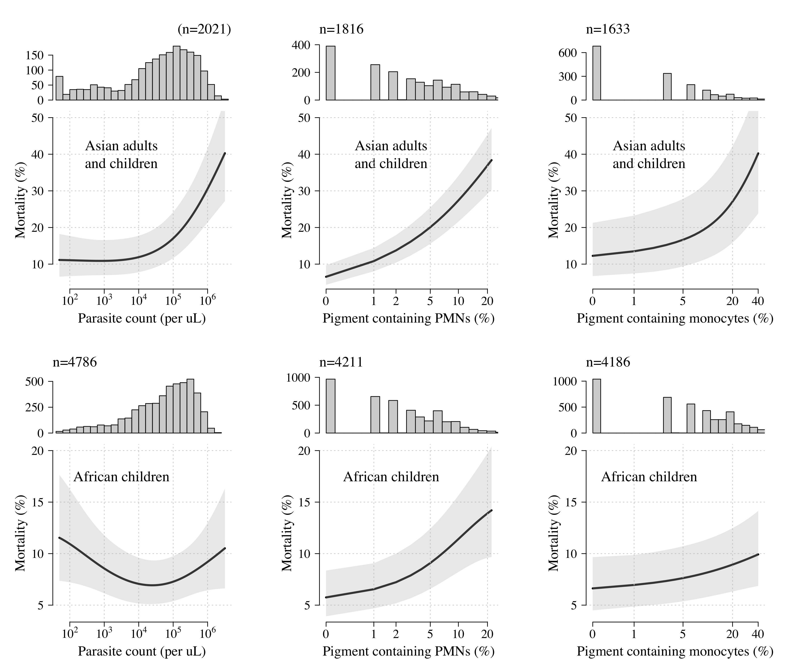<!-- -->

### 5% prognostic value


```r
## Neutrophils
mod_5percentMORU_PMN = 
  glmer(outcome ~ (prop_pigneut>0.05) + (1|country_f:study),
        family='binomial', data = pigmt_data[pigmt_data$study %in% c('AQ','AQUAMAT','SEAQUAMAT'), ])

xx=summary(mod_5percentMORU_PMN)
writeLines(sprintf('In the MORU data (n=%s), the odds ratio for death in those with >5%% pigment containing PMNs is %s (95%% CI %s to %s)',
                   length(xx$residuals),
                   round(exp(xx$coefficients[2,1]),2),
                   round(exp(xx$coefficients[2,1]-1.96*xx$coefficients[2,2]),2),
                   round(exp(xx$coefficients[2,1]+1.96*xx$coefficients[2,2]),2)))
```

```
## In the MORU data (n=6027), the odds ratio for death in those with >5% pigment containing PMNs is 2.39 (95% CI 2.02 to 2.81)
```

```r
## Monocytes
mod_5percentMORU_PMM = 
  glmer(outcome ~ (prop_pigmono>0.05) + (1|country_f:study),
        family='binomial', data = pigmt_data[pigmt_data$study %in% c('AQ','AQUAMAT','SEAQUAMAT'), ])

xx=summary(mod_5percentMORU_PMM)
writeLines(sprintf('In the MORU data (n=%s), the odds ratio for death in those with >5%% pigment containing PMMs is %s (95%% CI %s to %s)',
                   length(xx$residuals),
                   round(exp(xx$coefficients[2,1]),2),
                   round(exp(xx$coefficients[2,1]-1.96*xx$coefficients[2,2]),2),
                   round(exp(xx$coefficients[2,1]+1.96*xx$coefficients[2,2]),2)))
```

```
## In the MORU data (n=5819), the odds ratio for death in those with >5% pigment containing PMMs is 1.31 (95% CI 1.1 to 1.55)
```

### In cerebral malaria


```r
ind_cerebral = pigmt_data$coma==1
# Parasite counts
mod_PCT_AQ = gam(outcome ~ s(log10(parasitaemia+lambda_para),k=4) + 
                   s(country_f, bs='re'), 
                 family='binomial', 
                 data = pigmt_data[aq_ind&ind_cerebral, ])
summary(mod_PCT_AQ)
```

```
## 
## Family: binomial 
## Link function: logit 
## 
## Formula:
## outcome ~ s(log10(parasitaemia + lambda_para), k = 4) + s(country_f, 
##     bs = "re")
## 
## Parametric coefficients:
##             Estimate Std. Error z value Pr(>|z|)    
## (Intercept)  -1.5661     0.1822  -8.595   <2e-16 ***
## ---
## Signif. codes:  0 '***' 0.001 '**' 0.01 '*' 0.05 '.' 0.1 ' ' 1
## 
## Approximate significance of smooth terms:
##                                        edf Ref.df Chi.sq p-value    
## s(log10(parasitaemia + lambda_para)) 1.449  1.752  0.828   0.486    
## s(country_f)                         6.402  8.000 67.241  <2e-16 ***
## ---
## Signif. codes:  0 '***' 0.001 '**' 0.01 '*' 0.05 '.' 0.1 ' ' 1
## 
## R-sq.(adj) =  0.0433   Deviance explained = 4.88%
## UBRE = -0.089896  Scale est. = 1         n = 1680
```

```r
mod_PCT_SQ = gam(outcome ~ s(log10(parasitaemia+lambda_para),k=4) + 
                   s(country_f, bs='re'),
                 family='binomial', 
                 data = pigmt_data[sq_ind&ind_cerebral, ])
summary(mod_PCT_SQ)
```

```
## 
## Family: binomial 
## Link function: logit 
## 
## Formula:
## outcome ~ s(log10(parasitaemia + lambda_para), k = 4) + s(country_f, 
##     bs = "re")
## 
## Parametric coefficients:
##             Estimate Std. Error z value Pr(>|z|)   
## (Intercept)  -0.9338     0.2839  -3.289    0.001 **
## ---
## Signif. codes:  0 '***' 0.001 '**' 0.01 '*' 0.05 '.' 0.1 ' ' 1
## 
## Approximate significance of smooth terms:
##                                        edf Ref.df Chi.sq  p-value    
## s(log10(parasitaemia + lambda_para)) 2.564  2.857  27.98 1.87e-05 ***
## s(country_f)                         2.582  3.000  23.14 6.70e-06 ***
## ---
## Signif. codes:  0 '***' 0.001 '**' 0.01 '*' 0.05 '.' 0.1 ' ' 1
## 
## R-sq.(adj) =  0.084   Deviance explained = 7.42%
## UBRE = 0.18405  Scale est. = 1         n = 629
```

```r
## Neutrophils
mod_PN_AQ = gam(outcome ~ s(log10(prop_pigneut+lambda_pigment),k=4) + 
                  s(country_f, bs='re'), 
                family='binomial',
                data = pigmt_data[aq_ind&ind_cerebral, ])
summary(mod_PN_AQ)
```

```
## 
## Family: binomial 
## Link function: logit 
## 
## Formula:
## outcome ~ s(log10(prop_pigneut + lambda_pigment), k = 4) + s(country_f, 
##     bs = "re")
## 
## Parametric coefficients:
##             Estimate Std. Error z value Pr(>|z|)    
## (Intercept)  -1.5252     0.2328  -6.551  5.7e-11 ***
## ---
## Signif. codes:  0 '***' 0.001 '**' 0.01 '*' 0.05 '.' 0.1 ' ' 1
## 
## Approximate significance of smooth terms:
##                                           edf Ref.df Chi.sq p-value    
## s(log10(prop_pigneut + lambda_pigment)) 1.000  1.001  9.321 0.00227 ** 
## s(country_f)                            6.849  8.000 61.900 < 2e-16 ***
## ---
## Signif. codes:  0 '***' 0.001 '**' 0.01 '*' 0.05 '.' 0.1 ' ' 1
## 
## R-sq.(adj) =  0.0538   Deviance explained = 6.23%
## UBRE = -0.080885  Scale est. = 1         n = 1461
```

```r
mod_PN_SQ = gam(outcome ~ s(log10(prop_pigneut+lambda_pigment),k=4) +
                  s(country_f, bs='re'), 
                family='binomial',
                data = pigmt_data[sq_ind&ind_cerebral, ])
summary(mod_PN_SQ)
```

```
## 
## Family: binomial 
## Link function: logit 
## 
## Formula:
## outcome ~ s(log10(prop_pigneut + lambda_pigment), k = 4) + s(country_f, 
##     bs = "re")
## 
## Parametric coefficients:
##             Estimate Std. Error z value Pr(>|z|)    
## (Intercept)  -0.8471     0.1779  -4.761 1.93e-06 ***
## ---
## Signif. codes:  0 '***' 0.001 '**' 0.01 '*' 0.05 '.' 0.1 ' ' 1
## 
## Approximate significance of smooth terms:
##                                         edf Ref.df Chi.sq  p-value    
## s(log10(prop_pigneut + lambda_pigment)) 1.0      1  29.83  < 2e-16 ***
## s(country_f)                            1.9      3  10.83 0.000914 ***
## ---
## Signif. codes:  0 '***' 0.001 '**' 0.01 '*' 0.05 '.' 0.1 ' ' 1
## 
## R-sq.(adj) =  0.0782   Deviance explained = 7.07%
## UBRE = 0.18196  Scale est. = 1         n = 580
```

```r
## Monocytes
mod_PM_AQ = gam(outcome ~ s(log10(prop_pigmono+lambda_pigment),k=4) + s(country_f, bs='re'), 
                family='binomial',
                data = pigmt_data[aq_ind&ind_cerebral, ])
summary(mod_PM_AQ)
```

```
## 
## Family: binomial 
## Link function: logit 
## 
## Formula:
## outcome ~ s(log10(prop_pigmono + lambda_pigment), k = 4) + s(country_f, 
##     bs = "re")
## 
## Parametric coefficients:
##             Estimate Std. Error z value Pr(>|z|)    
## (Intercept)  -1.5122     0.2357  -6.417 1.39e-10 ***
## ---
## Signif. codes:  0 '***' 0.001 '**' 0.01 '*' 0.05 '.' 0.1 ' ' 1
## 
## Approximate significance of smooth terms:
##                                           edf Ref.df Chi.sq p-value    
## s(log10(prop_pigmono + lambda_pigment)) 1.506  1.805  0.841   0.652    
## s(country_f)                            6.880  8.000 68.372  <2e-16 ***
## ---
## Signif. codes:  0 '***' 0.001 '**' 0.01 '*' 0.05 '.' 0.1 ' ' 1
## 
## R-sq.(adj) =   0.05   Deviance explained = 5.85%
## UBRE = -0.076964  Scale est. = 1         n = 1452
```

```r
mod_PM_SQ = gam(outcome ~ s(log10(prop_pigmono+lambda_pigment),k=4) +
                  s(country_f, bs='re'), 
                family='binomial',
                data = pigmt_data[sq_ind&ind_cerebral, ])
summary(mod_PM_SQ)
```

```
## 
## Family: binomial 
## Link function: logit 
## 
## Formula:
## outcome ~ s(log10(prop_pigmono + lambda_pigment), k = 4) + s(country_f, 
##     bs = "re")
## 
## Parametric coefficients:
##             Estimate Std. Error z value Pr(>|z|)    
## (Intercept)  -0.8682     0.2458  -3.533 0.000411 ***
## ---
## Signif. codes:  0 '***' 0.001 '**' 0.01 '*' 0.05 '.' 0.1 ' ' 1
## 
## Approximate significance of smooth terms:
##                                           edf Ref.df Chi.sq  p-value    
## s(log10(prop_pigmono + lambda_pigment)) 1.483  1.765  8.929   0.0231 *  
## s(country_f)                            2.423  3.000 18.264 5.37e-05 ***
## ---
## Signif. codes:  0 '***' 0.001 '**' 0.01 '*' 0.05 '.' 0.1 ' ' 1
## 
## R-sq.(adj) =  0.0422   Deviance explained = 4.17%
## UBRE = 0.22185  Scale est. = 1         n = 580
```


```r
par(mfrow=c(3,2), las=1, bty='n', cex.lab=1.3,
    cex.axis=1.3, family='serif')

####********* Parasite counts *********#######
xs = seq(log10(lambda_para),6,length.out = 100)
my_preds=predict(mod_PCT_AQ,
                 newdata=data.frame(parasitaemia=10^xs,
                                    country_f = 0,
                                    lambda_para=lambda_para),
                 exclude = "s(country_f)",se.fit = T)
```

```
## Warning in predict.gam(mod_PCT_AQ, newdata = data.frame(parasitaemia = 10^xs, :
## factor levels 0 not in original fit
```

```r
plot(xs,100*inv.logit(my_preds$fit), panel.first = grid(),
     ylab = 'Mortality (%)', xaxt='n', ylim = c(9,35),
     xlab='Parasite count (per uL)',type='l',lwd=3)
axis(1, at = 1:6, labels = c(10,
                             expression(10^2),
                             expression(10^3),
                             expression(10^4),
                             expression(10^5),
                             expression(10^6)))
polygon(x = c(xs, rev(xs)),
        y = 100*inv.logit(c(my_preds$fit+1.96*my_preds$se.fit,
                            rev(my_preds$fit-1.96*my_preds$se.fit))),
        border = NA, col = adjustcolor('grey',alpha.f = .3))
mtext(text = paste('AQUAMAT (n=',
                   sum(!is.na(mod_PCT_AQ$model[,2])),')',
                   sep=''),line = 1.5,
      side = 3, adj = 0, cex=1.2)

my_preds=predict(mod_PCT_SQ,
                 newdata=data.frame(parasitaemia=10^xs,
                                    country_f = 0,
                                    lambda_para=lambda_para),
                 exclude = "s(country_f)",se.fit = T)
```

```
## Warning in predict.gam(mod_PCT_SQ, newdata = data.frame(parasitaemia = 10^xs, :
## factor levels 0 not in original fit
```

```r
plot(xs, 100*inv.logit(my_preds$fit), panel.first = grid(),
     ylab = 'Mortality (%)', xaxt='n',ylim = c(10,60),
     xlab='Parasite count (per uL)',type='l',lwd=3)
axis(1, at = 1:6, labels = c(10,
                             expression(10^2),
                             expression(10^3),
                             expression(10^4),
                             expression(10^5),
                             expression(10^6)))
polygon(x = c(xs, rev(xs)),
        y = 100*inv.logit(c(my_preds$fit+1.96*my_preds$se.fit,
                            rev(my_preds$fit-1.96*my_preds$se.fit))),
        border = NA, col = adjustcolor('grey',alpha.f = .3))
mtext(text = paste('SEAQUAMAT (n=',
                   sum(!is.na(mod_PCT_SQ$model[,2])),')',
                   sep=''),line = 1.5,
      side = 3, adj = 0, cex=1.2)

####********* Neutrophils *********#######
xs = (0: round(100*quantile(pigmt_data$prop_pigneut[aq_ind], 
                            probs = .99, na.rm = T)))/100
my_preds=predict(mod_PN_AQ,
                 newdata=data.frame(prop_pigneut=xs,
                                    lambda_pigment=lambda_pigment,
                                    country_f = 0),
                 exclude = "s(country_f)",se.fit = T)
```

```
## Warning in predict.gam(mod_PN_AQ, newdata = data.frame(prop_pigneut = xs, :
## factor levels 0 not in original fit
```

```r
plot(log10(xs+lambda_pigment),
     100*inv.logit(my_preds$fit), panel.first = grid(),
     ylab = 'Mortality (%)', xaxt='n', ylim = c(9,35),
     xlab='Pigment containing PMNs (%)',type='l',lwd=3)
axis(1, at = log10(c(0,1,2,5,10)/100+lambda_pigment), 
     labels = c(0,1,2,5,10))
polygon(x = log10(c(xs, rev(xs))+lambda_pigment),
        y = 100*inv.logit(c(my_preds$fit+1.96*my_preds$se.fit,
                            rev(my_preds$fit-1.96*my_preds$se.fit))),
        border = NA, col = adjustcolor('grey',alpha.f = .3))
mtext(text = paste('AQUAMAT (n=',
                   sum(!is.na(mod_PN_AQ$model[,2])),')',
                   sep=''),line = 1.5,
      side = 3, adj = 0, cex=1.2)

xs = (0: round(100*quantile(pigmt_data$prop_pigneut[sq_ind], 
                            probs = .99, na.rm = T)))/100
my_preds=predict(mod_PN_SQ,
                 newdata=data.frame(prop_pigneut=xs,
                                    lambda_pigment=lambda_pigment,
                                    country_f = 0),
                 exclude = "s(country_f)",se.fit = T)
```

```
## Warning in predict.gam(mod_PN_SQ, newdata = data.frame(prop_pigneut = xs, :
## factor levels 0 not in original fit
```

```r
plot(log10(xs+lambda_pigment), 
     100*inv.logit(my_preds$fit), panel.first = grid(),
     ylab = 'Mortality (%)', xaxt='n',ylim = c(10,60),
     xlab='Pigment containing PMNs (%)',
     type='l',lwd=3)
axis(1, at = log10(c(0,1,2,5,10,20)/100 +lambda_pigment), 
     labels = c(0,1,2,5,10,20))
polygon(x = log10(c(xs, rev(xs))+lambda_pigment),
        y = 100*inv.logit(c(my_preds$fit+1.96*my_preds$se.fit,
                            rev(my_preds$fit-1.96*my_preds$se.fit))),
        border = NA, col = adjustcolor('grey',alpha.f = .3))
mtext(text = paste('SEAQUAMAT (n=',
                   sum(!is.na(mod_PN_SQ$model[,2])),')',
                   sep=''),line = 1.5,
      side = 3, adj = 0, cex=1.2)


####********* Monocytes *********#######
xs = (0: round(100*quantile(pigmt_data$prop_pigmono[aq_ind], 
                            probs = .99, na.rm = T)))/100
my_preds=predict(mod_PM_AQ,
                 newdata=data.frame(prop_pigmono=xs,
                                    lambda_pigment=lambda_pigment,
                                    country_f = 0),
                 exclude = "s(country_f)",se.fit = T)
```

```
## Warning in predict.gam(mod_PM_AQ, newdata = data.frame(prop_pigmono = xs, :
## factor levels 0 not in original fit
```

```r
plot(log10(xs+lambda_pigment),
     100*inv.logit(my_preds$fit), panel.first = grid(),
     ylab = 'Mortality (%)', xaxt='n', ylim = c(9,35),
     xlab = 'Pigment containing PMMs (%)',
     type='l',lwd=3)
axis(1, at = log10(c(0,1,5,10,20,40)/100+lambda_pigment), 
     labels = c(0,1,5,10,20,40))
polygon(x = log10(c(xs, rev(xs))+lambda_pigment),
        y = 100*inv.logit(c(my_preds$fit+1.96*my_preds$se.fit,
                            rev(my_preds$fit-1.96*my_preds$se.fit))),
        border = NA, col = adjustcolor('grey',alpha.f = .3))
mtext(text = paste('AQUAMAT (n=',
                   sum(!is.na(mod_PM_AQ$model[,2])),')',
                   sep=''),line = 1.2,
      side = 3, adj = 0, cex=1.2)

xs = (0: round(100*quantile(pigmt_data$prop_pigmono[sq_ind], 
                            probs = .99, na.rm = T)))/100
my_preds=predict(mod_PM_SQ,
                 newdata=data.frame(prop_pigmono=xs,
                                    lambda_pigment=lambda_pigment,
                                    country_f = 0),
                 exclude = "s(country_f)",se.fit = T)
```

```
## Warning in predict.gam(mod_PM_SQ, newdata = data.frame(prop_pigmono = xs, :
## factor levels 0 not in original fit
```

```r
plot(log10(xs+lambda_pigment), 
     100*inv.logit(my_preds$fit), panel.first = grid(),
     ylab = 'Mortality (%)', xaxt='n',ylim = c(10,60),
     xlab='Pigment containing PMMs (%)',type='l',lwd=3)
axis(1, at = log10(c(0,1,2,5,10,15)/100+lambda_pigment), 
     labels = c(0,1,2,5,10,15))
polygon(x = log10(c(xs, rev(xs))+lambda_pigment),
        y = 100*inv.logit(c(my_preds$fit+1.96*my_preds$se.fit,
                            rev(my_preds$fit-1.96*my_preds$se.fit))),
        border = NA, col = adjustcolor('grey',alpha.f = .3))
mtext(text = paste('SEAQUAMAT (n=',
                   sum(!is.na(mod_PM_SQ$model[,2])),')',
                   sep=''),line = 1.5,
      side = 3, adj = 0, cex=1.2)
```

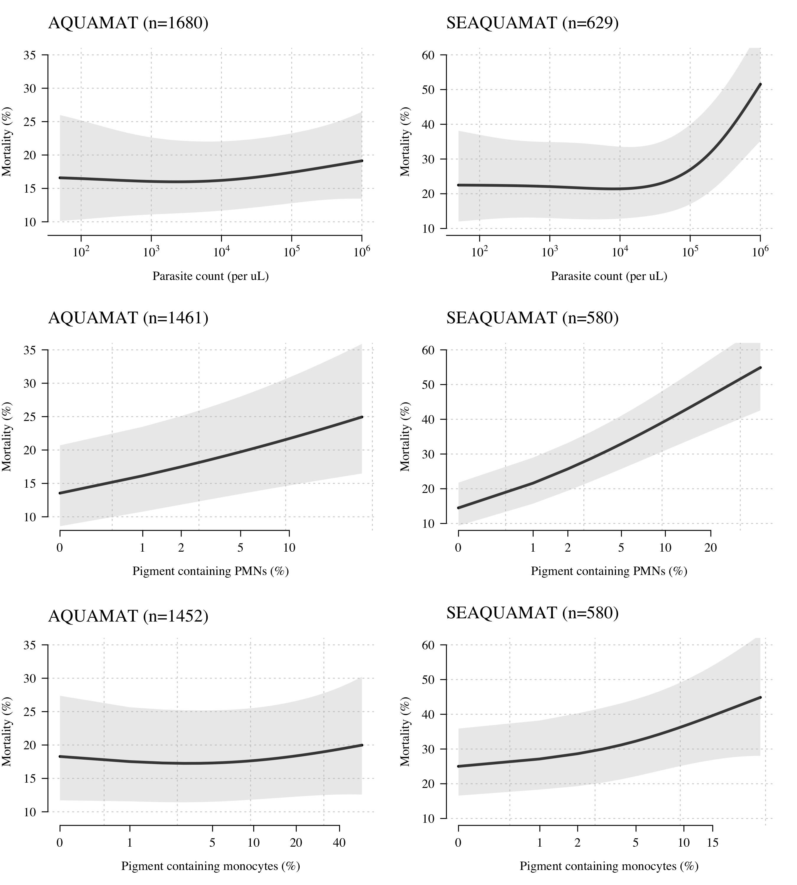<!-- -->


## Overall model
### PMNs


```r
ind_not_na_neut = !is.na(pigmt_data$prop_pigneut)
ind_MORU = aqViet_ind | aq_ind | sq_ind
writeLines(sprintf('We have PMN data on a total of %s patients from the 3 MORU trials', sum(ind_MORU & ind_not_na_neut)))
```

```
## We have PMN data on a total of 6027 patients from the 3 MORU trials
```

Mixed effects for site, country and study


```r
# box-cox transformation
mod_all=glmer(outcome ~ log10(prop_pigneut+lambda_pigment) +
                (1|site:country:study), 
              family='binomial', data = pigmt_data[ind_MORU,])
summary(mod_all)$coefficients
```

```
##                                        Estimate Std. Error   z value
## (Intercept)                          -0.7189118 0.17582412 -4.088812
## log10(prop_pigneut + lambda_pigment)  0.9267863 0.08753163 10.588016
##                                          Pr(>|z|)
## (Intercept)                          4.335884e-05
## log10(prop_pigneut + lambda_pigment) 3.386948e-26
```

```r
writeLines('Odds-ratio for death for a tenfold increase in PMNs (box-cox transformation):')
```

```
## Odds-ratio for death for a tenfold increase in PMNs (box-cox transformation):
```

```r
round(exp(summary(mod_all)$coefficients[2,1]+c(-1,0,1)*1.96*summary(mod_all)$coefficients[2,2]),2)
```

```
## [1] 2.13 2.53 3.00
```

```r
# box-cox transformation - just using >0 data
writeLines('Odds-ratio for death for a tenfold increase in PMNs (box-cox transformation only >0 counts):')
```

```
## Odds-ratio for death for a tenfold increase in PMNs (box-cox transformation only >0 counts):
```

```r
mod_all_pos=glmer(outcome ~ log10(prop_pigneut) + 
                    (1|site:country:study), 
                  family='binomial', 
                  data = pigmt_data[ind_MORU&pigmt_data$prop_pigneut>0, ])
exp(summary(mod_all_pos)$coefficients)[2,1]
```

```
## [1] 2.689449
```

```r
writeLines('Odds-ratio for death for PMNs > 5%:')
```

```
## Odds-ratio for death for PMNs > 5%:
```

```r
mod_all=glmer(outcome ~ as.numeric(prop_pigneut > 0.05) + 
                (1|site:country:study), 
              family='binomial', data = pigmt_data[ind_MORU,])
summary(mod_all)$coefficients
```

```
##                                   Estimate Std. Error   z value     Pr(>|z|)
## (Intercept)                     -2.3897853 0.13501306 -17.70040 4.163329e-70
## as.numeric(prop_pigneut > 0.05)  0.8750535 0.08444453  10.36246 3.673714e-25
```

```r
round(exp(summary(mod_all)$coefficients[2,1]+c(-1,0,1)*1.96*summary(mod_all)$coefficients[2,2]),2)
```

```
## [1] 2.03 2.40 2.83
```


### PMMs


```r
ind_not_na_mono = !is.na(pigmt_data$prop_pigmono)
writeLines(sprintf('We have PMN data on a total of %s patients from the 3 MORU trials', sum(ind_MORU & ind_not_na_mono)))
```

```
## We have PMN data on a total of 5819 patients from the 3 MORU trials
```

Mixed effects for site, country and study


```r
# box-cox transformation
mod_all=glmer(outcome ~ log10(prop_pigmono+lambda_pigment) +
                (1|site:country:study), 
              family='binomial', data = pigmt_data[ind_MORU,])
summary(mod_all)$coefficients
```

```
##                                        Estimate Std. Error   z value
## (Intercept)                          -1.6179278 0.17487642 -9.251835
## log10(prop_pigmono + lambda_pigment)  0.3309347 0.06866728  4.819394
##                                          Pr(>|z|)
## (Intercept)                          2.206715e-20
## log10(prop_pigmono + lambda_pigment) 1.439947e-06
```

```r
writeLines('Odds-ratio for death for a tenfold increase in PMMs (box-cox transformation):')
```

```
## Odds-ratio for death for a tenfold increase in PMMs (box-cox transformation):
```

```r
round(exp(summary(mod_all)$coefficients[2,1]+c(-1,0,1)*1.96*summary(mod_all)$coefficients[2,2]),2)
```

```
## [1] 1.22 1.39 1.59
```

```r
# box-cox transformation - just using >0 data
writeLines('Odds-ratio for death for a tenfold increase in PMMs (box-cox transformation only >0 counts):')
```

```
## Odds-ratio for death for a tenfold increase in PMMs (box-cox transformation only >0 counts):
```

```r
mod_all_pos=glmer(outcome ~ log10(prop_pigmono) + 
                    (1|site:country:study), 
                  family='binomial', 
                  data = pigmt_data[ind_MORU&pigmt_data$prop_pigmono>0, ])
exp(summary(mod_all_pos)$coefficients)[2,1]
```

```
## [1] 1.630057
```

```r
writeLines('Odds-ratio for death for PMMs > 5%:')
```

```
## Odds-ratio for death for PMMs > 5%:
```

```r
mod_all=glmer(outcome ~ as.numeric(prop_pigmono > 0.05) + 
                (1|site:country:study), 
              family='binomial', data = pigmt_data[ind_MORU,])
summary(mod_all)$coefficients
```

```
##                                   Estimate Std. Error    z value     Pr(>|z|)
## (Intercept)                     -2.2094892  0.1531057 -14.431138 3.295954e-47
## as.numeric(prop_pigmono > 0.05)  0.2715869  0.0877934   3.093478 1.978254e-03
```

```r
round(exp(summary(mod_all)$coefficients[2,1]+c(-1,0,1)*1.96*summary(mod_all)$coefficients[2,2]),2)
```

```
## [1] 1.10 1.31 1.56
```

# Meta-analysis

## Prognostic value in African children


```r
Af_ind = aq_ind|smac_ind|lyke_ind

writeLines(sprintf('We have data on pigment containing PMNs in %s African children',sum(Af_ind & !is.na(pigmt_data$prop_pigneut))))
```

```
## We have data on pigment containing PMNs in 30222 African children
```

```r
writeLines(sprintf('We have data on pigment containing PMMs in %s African children',sum(Af_ind & !is.na(pigmt_data$prop_pigmono))))
```

```
## We have data on pigment containing PMMs in 29377 African children
```

```r
writeLines(sprintf('We have data on parasite densities in %s African children',sum(Af_ind & !is.na(pigmt_data$parasitaemia))))
```

```
## We have data on parasite densities in 30868 African children
```

```r
### Models using Parasite counts
mod_PCT = gam(outcome ~ s(log10(parasitaemia+lambda_para),k=4) + 
                s(country_f, bs='re')+s(study_f, bs='re'), 
              family='binomial', 
              data = pigmt_data[Af_ind, ])
summary(mod_PCT)$s.pv
```

```
## [1] 0.0000000000 0.0000000000 0.0001050986
```

```r
## Neutrophils
mod_PN = gam(outcome ~ s(log10(prop_pigneut+lambda_pigment),k=4) + 
               s(country_f, bs='re')+s(study_f, bs='re'), 
             family='binomial', data = pigmt_data[Af_ind, ])
summary(mod_PN)$s.pv
```

```
## [1] 0.000000 0.000000 0.482333
```

```r
## Monocytes
mod_PM = gam(outcome ~ s(log10(prop_pigmono+lambda_pigment),k=4) + 
               s(country_f, bs='re')+s(study_f, bs='re'), 
             family='binomial', data = pigmt_data[Af_ind, ])
summary(mod_PM)$s.pv
```

```
## [1] 0.000000000 0.000000000 0.009103607
```


```r
par(las=1, bty='n', cex.lab=1.5, cex.axis=1.5, family='serif')
layout(mat = matrix(c(1,2,2,2,3,4,4,4,5,6,6,6),nrow = 4,byrow = F))

####********* Parasite counts *********#######
xs = seq(log10(lambda_para),6.5,length.out = 100)
par(mar = c(1,6,5,4))
hist(log10(pigmt_data$parasitaemia[Af_ind]+50),
     main ='', xlab='',xaxt='n',xlim = range(xs)+c(-.1,.1),
     breaks = 30, ylab ='', yaxt='n')
axis(2,at = c(0,1000,2000,3000))
mtext(text = paste0('n=',sum(notna_para&Af_ind)),
      line = 1,side = 3, adj = 0, cex=1.1)
par(mar = c(5,6,0,4))

my_preds=predict(mod_PCT,
                 newdata=data.frame(parasitaemia=10^xs,
                                    country_f = 0,
                                    study_f = 0,
                                    lambda_para=lambda_para),
                 exclude = c("s(country_f)","study_f"),
                 se.fit = T)
```

```
## Warning in predict.gam(mod_PCT, newdata = data.frame(parasitaemia = 10^xs, :
## factor levels 0 not in original fit

## Warning in predict.gam(mod_PCT, newdata = data.frame(parasitaemia = 10^xs, :
## factor levels 0 not in original fit
```

```r
plot(xs, 100*inv.logit(my_preds$fit), panel.first = grid(),
     ylab = 'Mortality (%)', xaxt='n',ylim = c(3,20),
     xlab='Parasite count (per uL)',type='l',lwd=3)
axis(1, at = 2:6, labels = c(expression(10^2),
                             expression(10^3),
                             expression(10^4),
                             expression(10^5),
                             expression(10^6)))
polygon(x = c(xs, rev(xs)),
        y = 100*inv.logit(c(my_preds$fit+1.96*my_preds$se.fit,
                            rev(my_preds$fit-1.96*my_preds$se.fit))),
        border = NA, col = adjustcolor('grey',alpha.f = .3))


####********* Neutrophils *********#######
xs = (0: round(100*quantile(pigmt_data$prop_pigneut, 
                            probs = .99, na.rm = T)))/100
par(mar = c(1,6,5,4))
hist(log10(pigmt_data$prop_pigneut[Af_ind]+lambda_pigment),
     main ='', xlab='', xaxt='n',ylab ='',
     xlim = range(log10(xs+lambda_pigment))+c(-.1,.1), breaks = 20)
mtext(text = paste0('n=',sum(notna_neut&Af_ind)),
      line = 1,side = 3, adj = 0, cex=1.1)
par(mar = c(5,6,0,4))

my_preds=predict(mod_PN,
                 newdata=data.frame(prop_pigneut=xs,
                                    lambda_pigment=lambda_pigment,
                                    country_f = 0,
                                    study_f=0),
                 exclude = c("s(country_f)","study_f)"),
                 se.fit = T)
```

```
## Warning in predict.gam(mod_PN, newdata = data.frame(prop_pigneut = xs,
## lambda_pigment = lambda_pigment, : factor levels 0 not in original fit
```

```
## Warning in predict.gam(mod_PN, newdata = data.frame(prop_pigneut = xs,
## lambda_pigment = lambda_pigment, : factor levels 0 not in original fit
```

```r
plot(log10(xs+lambda_pigment), 
     100*inv.logit(my_preds$fit), panel.first = grid(NA,NULL),
     ylab = 'Mortality (%)', xaxt='n',ylim = c(3,20),
     xlab='Pigment containing PMNs (%)',
     type='l',lwd=3)
abline(v=log10(my_v_ticks/100+lambda_pigment), lty='dotted',  col='lightgray')
axis(1, at = log10(c(0,1,2,5,10,20)/100 +lambda_pigment), 
     labels = c(0,1,2,5,10,20))
polygon(x = log10(c(xs, rev(xs))+lambda_pigment),
        y = 100*inv.logit(c(my_preds$fit+1.96*my_preds$se.fit,
                            rev(my_preds$fit-1.96*my_preds$se.fit))),
        border = NA, col = adjustcolor('grey',alpha.f = .3))


####********* Monocytes *********#######
xs = (0: round(100*quantile(pigmt_data$prop_pigmono, 
                            probs = .99, na.rm = T)))/100

par(mar = c(1,6,5,4))
hist(log10(pigmt_data$prop_pigmono[Af_ind]+lambda_pigment),
     main ='', xlab='', xaxt='n',ylab ='',yaxt='n',
     xlim = range(log10(xs+lambda_pigment))+c(-.1,.1), breaks = 20)
mtext(text = paste0('n=',sum(notna_mono&Af_ind)),
      line = 1,side = 3, adj = 0, cex=1.1)
axis(2, at=c(0,3000,6000,9000))
par(mar = c(5,6,0,4))

my_preds=predict(mod_PM,
                 newdata=data.frame(prop_pigmono=xs,
                                    lambda_pigment=lambda_pigment,
                                    country_f = 0,
                                    study_f = 0),
                 exclude = c("s(country_f)","study_f"),
                 se.fit = T)
```

```
## Warning in predict.gam(mod_PM, newdata = data.frame(prop_pigmono = xs,
## lambda_pigment = lambda_pigment, : factor levels 0 not in original fit
```

```
## Warning in predict.gam(mod_PM, newdata = data.frame(prop_pigmono = xs,
## lambda_pigment = lambda_pigment, : factor levels 0 not in original fit
```

```r
plot(log10(xs+lambda_pigment), 
     100*inv.logit(my_preds$fit), panel.first = grid(NA,NULL),
     ylab = 'Mortality (%)', xaxt='n',ylim = c(3,20),
     xlab='Pigment containing PMMs (%)',type='l',lwd=3)
abline(v=log10(my_v_ticks/100+lambda_pigment), lty='dotted',  col='lightgray')
axis(1, at = log10(c(0,1,5,20,40)/100+lambda_pigment), 
     labels = c(0,1,5,20,40))
polygon(x = log10(c(xs, rev(xs))+lambda_pigment),
        y = 100*inv.logit(c(my_preds$fit+1.96*my_preds$se.fit,
                            rev(my_preds$fit-1.96*my_preds$se.fit))),
        border = NA, col = adjustcolor('grey',alpha.f = .3))
```

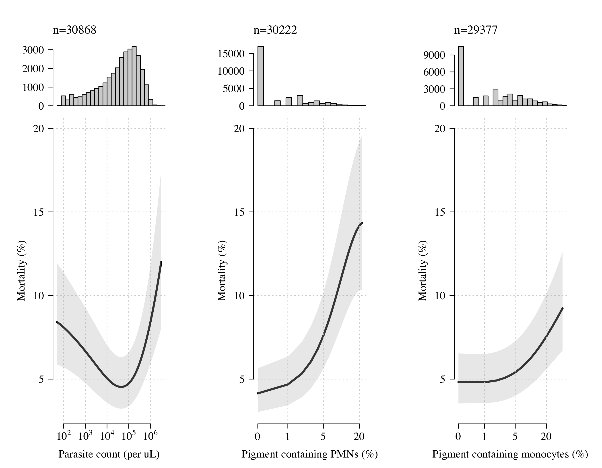<!-- -->


## Prognostic value of pigmented neutrophils alone: meta-analysis

Remove patients with no pigment data


```r
pigmt_data = filter(pigmt_data, 
                    !is.na(prop_pigmono) | !is.na(prop_pigneut))
apply(pigmt_data, 2, function(x) round(100*mean(is.na(x)),1))
```

```
##               study                site             country                  id 
##                 0.0                 0.0                 0.0                81.2 
##                 age                 art             outcome           resp_rate 
##                 0.2                 0.0                 0.0                 0.9 
##             lactate acute_renal_failure                 bun                  hb 
##                22.3                98.5                84.0                 2.4 
##       hypoglycaemia            acidosis         base_excess                coma 
##                 0.7                 2.4                42.4                 0.0 
##        parasitaemia            pig_neut      pig_neut_denom            pig_mono 
##                 0.8                 0.0                 0.0                 3.2 
##      pig_mono_denom           meta_code              site_f           country_f 
##                 0.0                 0.0                 0.0                 0.0 
##             study_f        prop_pigneut        prop_pigmono         lambda_para 
##                 0.0                 0.0                 3.2                 0.0 
##      lambda_pigment 
##                 0.0
```

```r
aqViet_ind = pigmt_data$study == 'AQ'  
aq_ind = pigmt_data$study == 'AQUAMAT'  
sq_ind = pigmt_data$study == 'SEAQUAMAT'
smac_ind = pigmt_data$study == 'SMAC'
lyke_ind = pigmt_data$study == 'Lyke et al'
Af_ind = aq_ind|smac_ind|lyke_ind
```


```r
quantile(round(100*pigmt_data$prop_pigneut), 
         seq(0,1,by=.1), na.rm = T)
```

```
##   0%  10%  20%  30%  40%  50%  60%  70%  80%  90% 100% 
##    0    0    0    0    0    0    1    2    3    6  100
```

```r
mycuts = c(-1,0,1,2,5,100)
pigmt_data$pig_neut100_bins =
  cut(round(100*pigmt_data$prop_pigneut), 
      breaks = mycuts, right = T,
      include.lowest = T)
table(pigmt_data$pig_neut100_bins)
```

```
## 
##  [-1,0]   (0,1]   (1,2]   (2,5] (5,100] 
##   18847    2610    3761    3275    3545
```

```r
mod_all=glmer(outcome ~ pig_neut100_bins + (1|site:country:study), 
              family='binomial', data = pigmt_data)
xxs = summary(mod_all)$coefficients[-1, ]


quantile(round(100*pigmt_data$prop_pigmono), seq(0,1,by=.1), na.rm = T)
```

```
##   0%  10%  20%  30%  40%  50%  60%  70%  80%  90% 100% 
##    0    0    0    0    0    2    3    4    7   13  100
```

```r
pigmt_data$pig_mono30_bins =
  cut(round(100*pigmt_data$prop_pigmono), 
      breaks = mycuts, include.lowest = T)
table(pigmt_data$pig_mono30_bins)
```

```
## 
##  [-1,0]   (0,1]   (1,2]   (2,5] (5,100] 
##   12645    1752    3707    4667    8239
```

```r
mod_all=glmer(outcome ~ pig_mono30_bins + (1|site:country:study), 
              family='binomial', data = pigmt_data)
xxs2 = summary(mod_all)$coefficients[-1, ]


par(mfrow=c(1,2), mar=c(5,6,4,6), las=1,
    bty='n',family='serif', cex.lab=1.3, cex.axis=1.3)
plot(c(0,xxs[,1]), 0:nrow(xxs), pch=16, xlim = c(-0.25, 1.2),
     ylab='', yaxt='n',panel.first = grid(),
     xlab='Odds-ratio for death', xaxt='n')
abline(v=0, lty=2, lwd=2)
mtext(text = 'a: pigment containing PMNs',side = 3,adj = 0,cex = 1.3, 
      line = 1.5)
axis(1, at = log(c(1,2,3)), labels = 1:3)
axis(2, at = 0:nrow(xxs), 
     labels = c('0%\n(reference)','(0-1]%','(1-2]%','(2-5]%','>5%'),tick = F)
# axis(2, at = 3, labels = expression(''>="5%"))
axis(4, at = 0:nrow(xxs),tick = F,
     labels = paste('n',table(pigmt_data$pig_neut100_bins),
                    sep='='))
for(i in 1:nrow(xxs)){
  upci = xxs[i,1]+1.96*xxs[i,2]
  loci = xxs[i,1]-1.96*xxs[i,2]
  lines(c(loci, upci), c(i,i), lwd=3)
}

rm(xxs)
plot(c(0,xxs2[,1]), 0:nrow(xxs2), pch=16, xlim = c(-0.25, 1.2),
     ylab='', yaxt='n',panel.first = grid(),
     xlab='Odds-ratio for death', xaxt='n')
abline(v=0, lty=2, lwd=2)
mtext(text = 'b: pigment containing PMMs',side = 3,adj = 0, cex = 1.3, 
      line = 1.5)
axis(1, at = log(c(1,2,3)), labels = 1:3)
axis(2, at = 0:nrow(xxs2), 
     labels = c('0%\n(reference)','(0-1]%','(1-2]%','(2-5]%','>5%'),tick = F)
axis(4, at = 0:nrow(xxs2),tick = F,
     labels = paste('n',table(pigmt_data$pig_mono30_bins),
                    sep='='))
for(i in 1:nrow(xxs2)){
  upci = xxs2[i,1]+1.96*xxs2[i,2]
  loci = xxs2[i,1]-1.96*xxs2[i,2]
  lines(c(loci, upci), c(i,i), lwd=3)
}
```

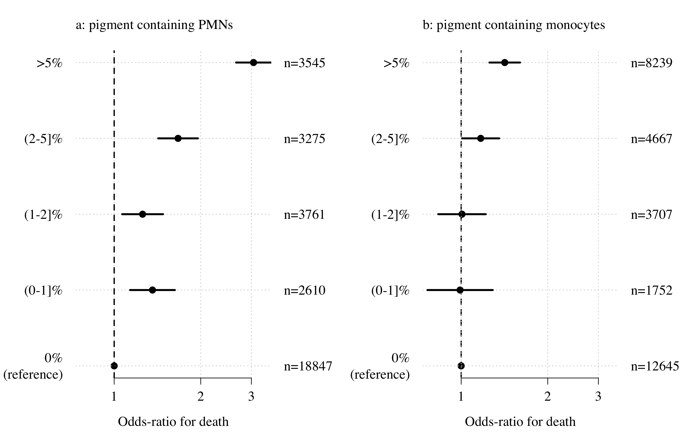<!-- -->


```r
ind_not_na = !is.na(pigmt_data$prop_pigneut) & !is.na(pigmt_data$outcome)
ind_pos = pigmt_data$prop_pigneut > 0.05
event_e = c()
n_e = c()
event_c = c()
n_c = c()
lab = c()
for(ss in unique(pigmt_data$meta_code)){
  ind = pigmt_data$meta_code==ss
  my_study = ss
  event_e = c(event_e, 
              sum(pigmt_data$outcome[ind_not_na&ind&ind_pos]))
  n_e = c(n_e, sum(ind_not_na&ind&ind_pos))
  event_c = c(event_c, sum(pigmt_data$outcome[ind_not_na&ind& !ind_pos]))
  n_c = c(n_c, sum(ind_not_na&ind& !ind_pos))
  lab = c(lab, ss)           
}

mod=metabin(event.e = event_e, n.e = n_e,event.c = event_c,
            n.c = n_c, studlab = lab,
            sm = 'OR',
            comb.random = T)
par(family='serif')
forest(mod, lab.e = '>5% pPMN', lab.c = '<5% pPMN',
       rightcols=F,
       test.overall.random=T,
       digits.pval=1, scientific.pval=T)
```

<!-- -->


Just looking at SMAC - what were they thinking???


```r
ind_not_na = !is.na(pigmt_data$prop_pigneut) & !is.na(pigmt_data$outcome) & pigmt_data$study=='SMAC'
ind_pos = pigmt_data$prop_pigneut > 0.05
event_e = c()
n_e = c()
event_c = c()
n_c = c()
lab = c()
for(ss in unique(pigmt_data$meta_code[pigmt_data$study=='SMAC'])){
  ind = pigmt_data$meta_code==ss
  my_study = ss
  event_e = c(event_e, 
              sum(pigmt_data$outcome[ind_not_na&ind&ind_pos]))
  n_e = c(n_e, sum(ind_not_na&ind&ind_pos))
  event_c = c(event_c, sum(pigmt_data$outcome[ind_not_na&ind& !ind_pos]))
  n_c = c(n_c, sum(ind_not_na&ind& !ind_pos))
  lab = c(lab, ss)           
}

mod=metabin(event.e = event_e, n.e = n_e,event.c = event_c,
            n.c = n_c, studlab = lab,
            sm = 'OR',
            comb.random = T)
par(family='serif')
forest(mod, lab.e = '>5% pPMN', lab.c = '<5% pPMN',
       rightcols=F,
       test.overall.random=T,
       digits.pval=1, scientific.pval=T)
```

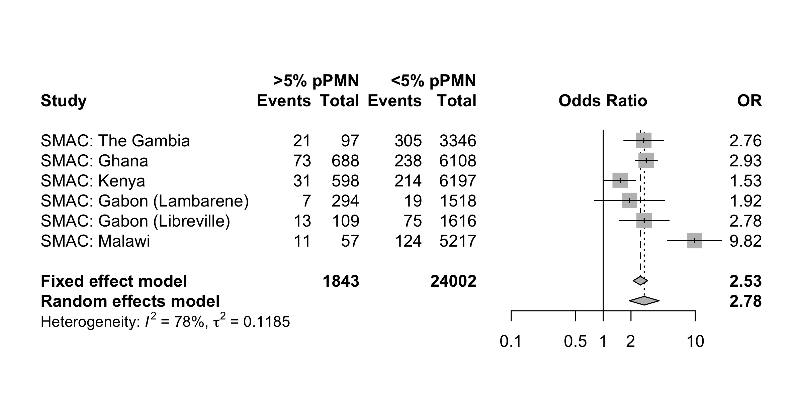<!-- -->

Any difference between children and adults?


```r
table(pigmt_data$study, pigmt_data$age>15)
```

```
##             
##              FALSE  TRUE
##   AQ             8   475
##   AQUAMAT     4195     0
##   Lyke et al   166     0
##   SEAQUAMAT    206  1127
##   SMAC       25808     0
```

```r
pigmt_data$Africa = as.numeric(Af_ind)
summary(glmer(outcome ~ as.numeric(pig_neut > 5) + (1|site:study),
              family = 'binomial', data = pigmt_data))
```

```
## Generalized linear mixed model fit by maximum likelihood (Laplace
##   Approximation) [glmerMod]
##  Family: binomial  ( logit )
## Formula: outcome ~ as.numeric(pig_neut > 5) + (1 | site:study)
##    Data: pigmt_data
## 
##      AIC      BIC   logLik deviance df.resid 
##  13229.6  13254.7  -6611.8  13223.6    32035 
## 
## Scaled residuals: 
##     Min      1Q  Median      3Q     Max 
## -0.7625 -0.2967 -0.1977 -0.1607  8.9438 
## 
## Random effects:
##  Groups     Name        Variance Std.Dev.
##  site:study (Intercept) 0.5182   0.7199  
## Number of obs: 32038, groups:  site:study, 29
## 
## Fixed effects:
##                          Estimate Std. Error z value Pr(>|z|)    
## (Intercept)              -2.60702    0.14177  -18.39   <2e-16 ***
## as.numeric(pig_neut > 5)  0.81189    0.05534   14.67   <2e-16 ***
## ---
## Signif. codes:  0 '***' 0.001 '**' 0.01 '*' 0.05 '.' 0.1 ' ' 1
## 
## Correlation of Fixed Effects:
##             (Intr)
## as.nmr(_>5) -0.148
```

```r
summary(glmer(outcome ~ as.numeric(pig_neut >5) * (age<15) + (1|site:study),
              family = 'binomial', data = pigmt_data))
```

```
## Generalized linear mixed model fit by maximum likelihood (Laplace
##   Approximation) [glmerMod]
##  Family: binomial  ( logit )
## Formula: outcome ~ as.numeric(pig_neut > 5) * (age < 15) + (1 | site:study)
##    Data: pigmt_data
## 
##      AIC      BIC   logLik deviance df.resid 
##  13183.4  13225.3  -6586.7  13173.4    31972 
## 
## Scaled residuals: 
##     Min      1Q  Median      3Q     Max 
## -0.8534 -0.2887 -0.2004 -0.1615  8.6653 
## 
## Random effects:
##  Groups     Name        Variance Std.Dev.
##  site:study (Intercept) 0.3478   0.5897  
## Number of obs: 31977, groups:  site:study, 29
## 
## Fixed effects:
##                                       Estimate Std. Error z value Pr(>|z|)    
## (Intercept)                            -2.1657     0.1903 -11.378  < 2e-16 ***
## as.numeric(pig_neut > 5)                1.1947     0.1359   8.788  < 2e-16 ***
## age < 15TRUE                           -0.7016     0.2092  -3.354 0.000797 ***
## as.numeric(pig_neut > 5):age < 15TRUE  -0.4644     0.1490  -3.117 0.001825 ** 
## ---
## Signif. codes:  0 '***' 0.001 '**' 0.01 '*' 0.05 '.' 0.1 ' ' 1
## 
## Correlation of Fixed Effects:
##             (Intr) a.(_>5 a<15TR
## as.nmr(_>5) -0.360              
## age<15TRUE  -0.773  0.325       
## a.(_>5):<15  0.332 -0.911 -0.340
```

```r
summary(glmer(outcome ~ as.numeric(pig_neut >5) * Africa + (1|site),
              family = 'binomial', data = pigmt_data))
```

```
## Generalized linear mixed model fit by maximum likelihood (Laplace
##   Approximation) [glmerMod]
##  Family: binomial  ( logit )
## Formula: outcome ~ as.numeric(pig_neut > 5) * Africa + (1 | site)
##    Data: pigmt_data
## 
##      AIC      BIC   logLik deviance df.resid 
##  13214.3  13256.1  -6602.1  13204.3    32033 
## 
## Scaled residuals: 
##     Min      1Q  Median      3Q     Max 
## -0.8310 -0.2887 -0.2002 -0.1612  8.6667 
## 
## Random effects:
##  Groups Name        Variance Std.Dev.
##  site   (Intercept) 0.3325   0.5766  
## Number of obs: 32038, groups:  site, 29
## 
## Fixed effects:
##                                 Estimate Std. Error z value Pr(>|z|)    
## (Intercept)                      -2.1990     0.2103 -10.456  < 2e-16 ***
## as.numeric(pig_neut > 5)          1.1580     0.1326   8.730  < 2e-16 ***
## Africa                           -0.6946     0.2571  -2.702  0.00689 ** 
## as.numeric(pig_neut > 5):Africa  -0.4253     0.1463  -2.907  0.00365 ** 
## ---
## Signif. codes:  0 '***' 0.001 '**' 0.01 '*' 0.05 '.' 0.1 ' ' 1
## 
## Correlation of Fixed Effects:
##             (Intr) as.(_>5) Africa
## as.nmr(_>5) -0.337                
## Africa      -0.824  0.277         
## as.n(_>5):A  0.306 -0.906   -0.285
```

```r
summary(glmer(outcome ~ as.numeric(pig_neut >5) + (1|site),
              family = 'binomial', data = pigmt_data[pigmt_data$age<15,]))
```

```
## Generalized linear mixed model fit by maximum likelihood (Laplace
##   Approximation) [glmerMod]
##  Family: binomial  ( logit )
## Formula: outcome ~ as.numeric(pig_neut > 5) + (1 | site)
##    Data: pigmt_data[pigmt_data$age < 15, ]
## 
##      AIC      BIC   logLik deviance df.resid 
##  11726.4  11751.3  -5860.2  11720.4    30330 
## 
## Scaled residuals: 
##     Min      1Q  Median      3Q     Max 
## -0.5178 -0.2565 -0.2003 -0.1614  8.7006 
## 
## Random effects:
##  Groups Name        Variance Std.Dev.
##  site   (Intercept) 0.3731   0.6108  
## Number of obs: 30333, groups:  site, 26
## 
## Fixed effects:
##                          Estimate Std. Error z value Pr(>|z|)    
## (Intercept)              -2.85562    0.14303  -19.96   <2e-16 ***
## as.numeric(pig_neut > 5)  0.73323    0.06149   11.93   <2e-16 ***
## ---
## Signif. codes:  0 '***' 0.001 '**' 0.01 '*' 0.05 '.' 0.1 ' ' 1
## 
## Correlation of Fixed Effects:
##             (Intr)
## as.nmr(_>5) -0.144
```


## Prognostic value of pigmented monocytes alone: meta-analysis


```r
ind_not_na = !is.na(pigmt_data$prop_pigmono) & !is.na(pigmt_data$outcome)
ind_pos = pigmt_data$prop_pigmono > 0.05
event_e = c()
n_e = c()
event_c = c()
n_c = c()
lab = c()
for(ss in unique(pigmt_data$meta_code)){
  ind = pigmt_data$meta_code==ss
  my_study = pigmt_data$study[ind][1]
  event_e = c(event_e, sum(pigmt_data$outcome[ind_not_na&ind&ind_pos]))
  n_e = c(n_e, sum(ind_not_na&ind&ind_pos))
  event_c = c(event_c, sum(pigmt_data$outcome[ind_not_na&ind& !ind_pos]))
  n_c = c(n_c, sum(ind_not_na&ind& !ind_pos))
  lab = c(lab, ss)           
}

mod=metabin(event.e = event_e, 
            n.e = n_e,
            event.c = event_c,
            n.c = n_c, studlab = lab, 
            sm = 'OR',
            comb.random = T)
par(family='serif')
forest(mod, lab.e = '>5% pPMM', lab.c = '<5% pPMM',
       rightcols=F,
       test.overall.random=T,
       digits.pval=1, scientific.pval=T)
```

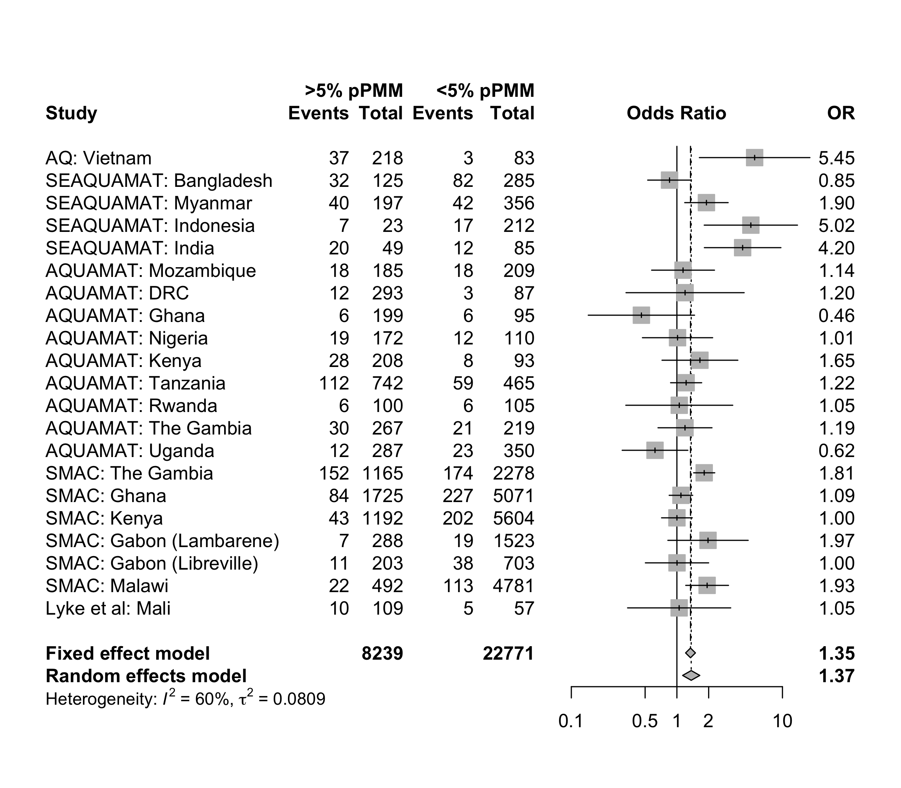<!-- -->


Mixed effect model

```r
mod_all=glmer(outcome ~ as.numeric(prop_pigmono) +
                (1|site:country:study), 
              family='binomial', data = pigmt_data)
summary(mod_all)$coefficients
```

```
##                           Estimate Std. Error    z value     Pr(>|z|)
## (Intercept)              -2.521557  0.1523346 -16.552750 1.529524e-61
## as.numeric(prop_pigmono)  2.030378  0.2501151   8.117774 4.748122e-16
```

```r
mod_all=glmer(outcome ~ log10(prop_pigmono+lambda_pigment) +
                (1|site:country:study), 
              family='binomial', data = pigmt_data)
summary(mod_all)$coefficients
```

```
##                                        Estimate Std. Error    z value
## (Intercept)                          -1.9207005 0.16216315 -11.844248
## log10(prop_pigmono + lambda_pigment)  0.2938478 0.04420657   6.647152
##                                          Pr(>|z|)
## (Intercept)                          2.304767e-32
## log10(prop_pigmono + lambda_pigment) 2.988183e-11
```

# Prognostic value of pigmented monocytes in addition to severity data

## Available clinical and lab data


```r
# clinical variables
writeLines('Coma:')
```

```
## Coma:
```

```r
table(pigmt_data$study,is.na(pigmt_data$coma))
```

```
##             
##              FALSE  TRUE
##   AQ           483     0
##   AQUAMAT     4217     0
##   Lyke et al   166     0
##   SEAQUAMAT   1333     0
##   SMAC       25834    13
```

```r
writeLines('Acidosis:')
```

```
## Acidosis:
```

```r
table(pigmt_data$study,is.na(pigmt_data$acidosis))
```

```
##             
##              FALSE  TRUE
##   AQ             0   483
##   AQUAMAT     4217     0
##   Lyke et al     0   166
##   SEAQUAMAT   1198   135
##   SMAC       25847     0
```

```r
writeLines('Respiratory rate:')
```

```
## Respiratory rate:
```

```r
table(pigmt_data$study,is.na(pigmt_data$resp_rate))
```

```
##             
##              FALSE  TRUE
##   AQ           482     1
##   AQUAMAT     4192    25
##   Lyke et al     0   166
##   SEAQUAMAT   1330     3
##   SMAC       25754    93
```

```r
# lab variables
writeLines('Lactate:')
```

```
## Lactate:
```

```r
table(pigmt_data$study,is.na(pigmt_data$lactate))
```

```
##             
##              FALSE  TRUE
##   AQ           479     4
##   AQUAMAT        0  4217
##   Lyke et al     0   166
##   SEAQUAMAT      0  1333
##   SMAC       24414  1433
```

```r
writeLines('Glucose:')
```

```
## Glucose:
```

```r
table(pigmt_data$study,is.na(pigmt_data$hypoglycaemia))
```

```
##             
##              FALSE  TRUE
##   AQ           483     0
##   AQUAMAT     4217     0
##   Lyke et al     0   166
##   SEAQUAMAT   1273    60
##   SMAC       25847     0
```

```r
writeLines('Bun:')
```

```
## Bun:
```

```r
table(pigmt_data$study,is.na(pigmt_data$bun))
```

```
##             
##              FALSE  TRUE
##   AQ           228   255
##   AQUAMAT     3650   567
##   Lyke et al     0   166
##   SEAQUAMAT   1252    81
##   SMAC           0 25847
```

```r
pigmt_data$PMNs5 = as.numeric(pigmt_data$prop_pigneut > 0.05)
pigmt_data$PMMs5 = as.numeric(pigmt_data$prop_pigmono > 0.05)
```

## Fit models

### AQ VIETNAM

Clinical: coma and respiratory rate
Lab: lactate and glucose


```r
#****** Neutrophils *********
# Model of prognostic value without severity included
mod_AQV_neut_alone = glm(outcome ~ PMNs5,
                         family='binomial', 
                         data = pigmt_data[aqViet_ind, ])
summary(mod_AQV_neut_alone)$coefficients
```

```
##              Estimate Std. Error    z value     Pr(>|z|)
## (Intercept) -2.381228  0.1819454 -13.087595 3.876887e-39
## PMNs5        1.783391  0.2829732   6.302332 2.931997e-10
```

```r
# Model of prognostic value with clinical markers of severity included
mod_AQV_neut_clinical = glm(outcome ~ PMNs5 + 
                              coma + resp_rate, 
                            family='binomial', 
                            data = pigmt_data[aqViet_ind, ])
summary(mod_AQV_neut_clinical)$coefficients
```

```
##               Estimate Std. Error   z value     Pr(>|z|)
## (Intercept) -4.3992431 0.63191367 -6.961779 3.360034e-12
## PMNs5        1.7793912 0.29743219  5.982511 2.197243e-09
## coma         0.3184973 0.29375348  1.084233 2.782613e-01
## resp_rate    0.0601044 0.01837873  3.270324 1.074244e-03
```

```r
# Model of prognostic value with clinical & lab markers of severity included
mod_AQV_neut_lab = glm(outcome ~ PMNs5 +
                         coma + resp_rate + lactate + hypoglycaemia, 
                       family='binomial', 
                       data = pigmt_data[aqViet_ind, ])
summary(mod_AQV_neut_lab)$coefficients
```

```
##                  Estimate Std. Error    z value     Pr(>|z|)
## (Intercept)   -4.29998050 0.65352884 -6.5796339 4.716081e-11
## PMNs5          1.33821725 0.32205696  4.1552191 3.249759e-05
## coma           0.18450433 0.30793385  0.5991687 5.490604e-01
## resp_rate      0.03415613 0.01997453  1.7099840 8.726883e-02
## lactate        0.17790110 0.04564326  3.8976426 9.713363e-05
## hypoglycaemia  0.26326889 0.49917472  0.5274083 5.979101e-01
```

```r
#****** Monocytes *********
# Model of prgnostic value without severity included
mod_AQV_mono_alone = glm(outcome ~ PMMs5, 
                         family='binomial', 
                         data = pigmt_data[aqViet_ind, ])
summary(mod_AQV_mono_alone)$coefficients
```

```
##              Estimate Std. Error   z value     Pr(>|z|)
## (Intercept) -3.283414  0.5880758 -5.583318 2.359725e-08
## PMMs5        1.695835  0.6151301  2.756872 5.835712e-03
```

```r
# Model of prognostic value with clinical markers of severity included
mod_AQV_mono_clinical = glm(outcome ~ PMMs5 + 
                              coma + resp_rate, 
                            family='binomial', 
                            data = pigmt_data[aqViet_ind, ])
summary(mod_AQV_mono_clinical)$coefficients
```

```
##                Estimate Std. Error    z value     Pr(>|z|)
## (Intercept) -5.05089658 0.98371781 -5.1344975 2.828989e-07
## PMMs5        1.64964757 0.61905550  2.6647814 7.703839e-03
## coma         0.06427030 0.35519869  0.1809418 8.564132e-01
## resp_rate    0.05965644 0.02496593  2.3895138 1.687069e-02
```

```r
# Model of prognostic value with clinical & lab markers of severity included
mod_AQV_mono_lab = glm(outcome ~ PMMs5 + 
                         coma + resp_rate + lactate + hypoglycaemia,
                       family='binomial', 
                       data = pigmt_data[aqViet_ind, ])
summary(mod_AQV_mono_lab)$coefficients
```

```
##                   Estimate Std. Error     z value     Pr(>|z|)
## (Intercept)   -4.216658600 1.03519162 -4.07331213 4.634924e-05
## PMMs5          1.199957496 0.63626931  1.88592703 5.930479e-02
## coma          -0.062048338 0.37653410 -0.16478810 8.691108e-01
## resp_rate      0.008703569 0.02923936  0.29766617 7.659580e-01
## lactate        0.205141058 0.05382206  3.81146810 1.381439e-04
## hypoglycaemia  0.048198663 0.66553590  0.07242083 9.422670e-01
```


### SEAQUAMAT

Clinical: coma and acidosis
Lab: BUN and glucose


```r
#****** Neutrophils *********
# Model of prgnostoc value without severity included
mod_SQ_neut_alone = glmer(outcome ~ PMNs5 + 
                            (1|site:country), 
                          family='binomial', 
                          data = pigmt_data[sq_ind, ])
summary(mod_SQ_neut_alone)$coefficients[2,]
```

```
##     Estimate   Std. Error      z value     Pr(>|z|) 
## 1.013016e+00 1.484940e-01 6.821930e+00 8.982527e-12
```

```r
# Model of prognostic value with clinical markers of severity included
mod_SQ_neut_clinical = glmer(outcome ~ PMNs5 + 
                               coma + acidosis +
                               (1|site:country), 
                             family='binomial', 
                             data = pigmt_data[sq_ind, ])
summary(mod_SQ_neut_clinical)$coefficients[2,]
```

```
##     Estimate   Std. Error      z value     Pr(>|z|) 
## 0.6160359021 0.1756288861 3.5076001205 0.0004521682
```

```r
# Model of prognostic value with clinical & lab markers of severity included
mod_SQ_neut_lab = glmer(outcome ~ PMNs5 + 
                          coma + acidosis + bun +
                          hypoglycaemia + (1|site:country), 
                        family='binomial', 
                        data = pigmt_data[sq_ind, ])
summary(mod_SQ_neut_lab)$coefficients[2,]
```

```
##    Estimate  Std. Error     z value    Pr(>|z|) 
## 0.490899642 0.188861140 2.599262301 0.009342436
```

```r
#****** Monocytes *********
# Model of prgnostoc value without severity included
mod_SQ_mono_alone = glmer(outcome ~ PMMs5 + 
                            (1|site:country), 
                          family='binomial', 
                          data = pigmt_data[sq_ind, ])
summary(mod_SQ_mono_alone)$coefficients
```

```
##               Estimate Std. Error   z value     Pr(>|z|)
## (Intercept) -1.8475029  0.2018076 -9.154772 5.447269e-20
## PMMs5        0.5142849  0.1508698  3.408799 6.524947e-04
```

```r
# Model of prognostic value with clinical markers of severity included
mod_SQ_mono_clinical = glmer(outcome ~ PMMs5 + 
                               coma + acidosis + 
                               (1|site:country), 
                             family='binomial', 
                             data = pigmt_data[sq_ind, ])
summary(mod_SQ_mono_clinical)$coefficients
```

```
##               Estimate Std. Error    z value     Pr(>|z|)
## (Intercept) -3.9898304  0.2710736 -14.718623 4.895236e-49
## PMMs5        0.2687599  0.1824519   1.473045 1.407388e-01
## coma         1.3340290  0.1862776   7.161511 7.979272e-13
## acidosis     2.1896671  0.2250487   9.729748 2.251501e-22
```

```r
# Model of prognostic value with clinical & lab markers of severity included
mod_SQ_mono_lab = glmer(outcome ~ PMMs5 + 
                          coma + acidosis + bun +
                          hypoglycaemia + (1|site:country), 
                        family='binomial', 
                        data = pigmt_data[sq_ind, ])
summary(mod_SQ_mono_lab)$coefficients
```

```
##                  Estimate Std. Error     z value     Pr(>|z|)
## (Intercept)   -4.63517219 0.30931422 -14.9853187 9.158517e-51
## PMMs5          0.14695375 0.19574283   0.7507491 4.528037e-01
## coma           1.34161438 0.20246042   6.6265516 3.436195e-11
## acidosis       1.57293409 0.24105933   6.5250910 6.796027e-11
## bun            0.01900949 0.00221956   8.5645312 1.085164e-17
## hypoglycaemia  1.33573690 0.53650777   2.4896879 1.278553e-02
```

### AQUAMAT

Clinical: coma and acidosis
Lab: BUN and glucose


```r
#****** Neutrophils *********
# Model of prognostic value without severity included
mod_AQ_neut_alone = glmer(outcome ~ PMNs5 + (1|site:country), 
                          family='binomial', data = pigmt_data[aq_ind, ])
summary(mod_AQ_neut_alone)$coefficients
```

```
##              Estimate Std. Error    z value     Pr(>|z|)
## (Intercept) -2.589313  0.1517512 -17.062882 2.803771e-65
## PMNs5        0.651347  0.1113824   5.847844 4.979851e-09
```

```r
# Model of prognostic value with clinical markers of severity included
mod_AQ_neut_clinical = glmer(outcome ~ PMNs5 + 
                               coma + acidosis + 
                               (1|site:country), 
                             family='binomial', 
                             data = pigmt_data[aq_ind, ])
summary(mod_AQ_neut_clinical)$coefficients
```

```
##               Estimate Std. Error    z value     Pr(>|z|)
## (Intercept) -3.6626794  0.1970765 -18.585064 4.244936e-77
## PMNs5        0.4903675  0.1187539   4.129276 3.639077e-05
## coma         1.7412533  0.1289991  13.498180 1.602880e-41
## acidosis     1.1712318  0.1315174   8.905525 5.313383e-19
```

```r
# Model of prognostic value with clinical & lab markers of severity included
mod_AQ_neut_lab = glmer(outcome ~ PMNs5 + 
                          coma + acidosis + bun +
                          hypoglycaemia + (1|site:country), 
                        family='binomial', 
                        data = pigmt_data[aq_ind, ])
summary(mod_AQ_neut_lab)$coefficients
```

```
##                  Estimate  Std. Error    z value     Pr(>|z|)
## (Intercept)   -4.33171591 0.225158451 -19.238522 1.761588e-82
## PMNs5          0.26465008 0.134380314   1.969411 4.890591e-02
## coma           1.67900622 0.142177776  11.809203 3.498618e-32
## acidosis       0.73072257 0.151052288   4.837547 1.314512e-06
## bun            0.03140051 0.003759358   8.352625 6.676235e-17
## hypoglycaemia  1.17406051 0.150944530   7.778092 7.362628e-15
```

```r
#****** Monocytes *********
# Model of prognostic value without severity included
mod_AQ_mono_alone = glmer(outcome ~ PMMs5 + (1|site:country), 
                          family='binomial', data = pigmt_data[aq_ind, ])
summary(mod_AQ_mono_alone)$coefficients
```

```
##                Estimate Std. Error     z value     Pr(>|z|)
## (Intercept) -2.45405542  0.1702992 -14.4102598 4.460292e-47
## PMMs5        0.09368014  0.1097358   0.8536876 3.932781e-01
```

```r
# Model of prognostic value with clinical markers of severity included
mod_AQ_mono_clinical = glmer(outcome ~ PMMs5 + 
                               coma + acidosis +
                               (1|site:country), 
                             family='binomial', 
                             data = pigmt_data[aq_ind, ])
summary(mod_AQ_mono_clinical)$coefficients
```

```
##                 Estimate Std. Error      z value     Pr(>|z|)
## (Intercept) -3.528956036  0.2058681 -17.14182654 7.234202e-66
## PMMs5       -0.009519482  0.1161335  -0.08197013 9.346705e-01
## coma         1.777158114  0.1289767  13.77890796 3.413974e-43
## acidosis     1.172779563  0.1314186   8.92400088 4.497403e-19
```

```r
# Model of prognostic value with clinical & lab markers of severity included
mod_AQ_mono_lab = glmer(outcome ~ PMMs5 + 
                          coma + acidosis + bun +
                          hypoglycaemia + (1|site:country), 
                        family='binomial', 
                        data = pigmt_data[aq_ind, ])
summary(mod_AQ_mono_lab)$coefficients
```

```
##                  Estimate  Std. Error    z value     Pr(>|z|)
## (Intercept)   -4.21868691 0.237219312 -17.783910 9.417694e-71
## PMMs5         -0.09814745 0.131417508  -0.746837 4.551620e-01
## coma           1.70258328 0.142698390  11.931342 8.125303e-33
## acidosis       0.71182445 0.151846982   4.687775 2.761917e-06
## bun            0.03183719 0.003774229   8.435415 3.300285e-17
## hypoglycaemia  1.19791031 0.150997558   7.933309 2.133824e-15
```


### SMAC

Clinical: coma and acidosis (deep breathing)
Lab: lactate and glucose


```r
#**** Neutrophils *****
# Model of prognostic value without severity included
mod_SMAC_neut_alone = glmer(outcome ~ PMNs5 + (1|site:country),
                            family='binomial', 
                            data = pigmt_data[smac_ind, ])
summary(mod_SMAC_neut_alone)$coefficients
```

```
##               Estimate Std. Error    z value     Pr(>|z|)
## (Intercept) -3.3218817 0.25889509 -12.830995 1.099426e-37
## PMNs5        0.9249743 0.09287892   9.958926 2.305405e-23
```

```r
# Model of prognostic value with clinical markers of severity included
mod_SMAC_neut_clinical = glmer(outcome ~ PMNs5 + 
                                 coma + acidosis + (1|site:country), 
                               family='binomial', 
                               data = pigmt_data[smac_ind, ])
summary(mod_SMAC_neut_clinical)$coefficients
```

```
##               Estimate Std. Error   z value      Pr(>|z|)
## (Intercept) -3.9417665 0.23445370 -16.81256  1.974612e-63
## PMNs5        0.4976095 0.10158591   4.89841  9.661506e-07
## coma         1.7411385 0.07154428  24.33652 8.054366e-131
## acidosis     1.4891664 0.07050895  21.12025  5.182394e-99
```

```r
# Model of prognostic value with clinical & lab markers of severity included
mod_SMAC_neut_lab = glmer(outcome ~ PMNs5 + 
                            coma + acidosis + lactate +
                            hypoglycaemia + (1|site:country), 
                          family='binomial', 
                          data = pigmt_data[smac_ind, ])
summary(mod_SMAC_neut_lab)$coefficients
```

```
##                 Estimate  Std. Error    z value     Pr(>|z|)
## (Intercept)   -4.6119435 0.221519495 -20.819583 2.876775e-96
## PMNs5          0.2288061 0.108114567   2.116330 3.431678e-02
## coma           1.5170492 0.076272749  19.889793 4.988027e-88
## acidosis       1.0587771 0.077789355  13.610822 3.453367e-42
## lactate        0.1249771 0.007358145  16.984871 1.062869e-64
## hypoglycaemia  0.7144154 0.089325057   7.997928 1.265299e-15
```

```r
#**** Monocytes *****
# Model of prognostic value without severity included
mod_SMAC_mono_alone = glmer(outcome ~ PMMs5 + (1|site:country),
                            family='binomial', 
                            data = pigmt_data[smac_ind, ])
summary(mod_SMAC_mono_alone)$coefficients
```

```
##               Estimate Std. Error    z value     Pr(>|z|)
## (Intercept) -3.2828836 0.23823730 -13.779889 3.367882e-43
## PMMs5        0.3134577 0.07030566   4.458498 8.253593e-06
```

```r
# Model of prognostic value with clinical markers of severity included
mod_SMAC_mono_clinical = glmer(outcome ~ PMMs5 + 
                                 coma + acidosis +
                                 (1|site:country), 
                               family='binomial', 
                               data = pigmt_data[smac_ind, ])
summary(mod_SMAC_mono_clinical)$coefficients
```

```
##               Estimate Std. Error    z value      Pr(>|z|)
## (Intercept) -3.9190705 0.22382337 -17.509657  1.209201e-68
## PMMs5        0.1008064 0.07492402   1.345448  1.784807e-01
## coma         1.7542667 0.07271620  24.124838 1.371954e-128
## acidosis     1.4870576 0.07139577  20.828370  2.394748e-96
```

```r
# Model of prognostic value with clinical & lab markers of severity included
mod_SMAC_mono_lab = glmer(outcome ~ PMMs5 + 
                            coma + acidosis + lactate +
                            hypoglycaemia + (1|site:country), 
                          family='binomial', 
                          data = pigmt_data[smac_ind, ])
summary(mod_SMAC_mono_lab)$coefficients
```

```
##                 Estimate  Std. Error    z value     Pr(>|z|)
## (Intercept)   -4.5697629 0.223764955 -20.422156 1.062687e-92
## PMMs5         -0.1312270 0.081246430  -1.615172 1.062734e-01
## coma           1.5325466 0.077571028  19.756688 7.026683e-87
## acidosis       1.0425960 0.078844676  13.223417 6.427620e-40
## lactate        0.1257886 0.007545098  16.671573 2.109685e-62
## hypoglycaemia  0.7308628 0.089951651   8.125063 4.471315e-16
```

## Output

Make summaries

```r
#**Neutrophils**
my_var = 'PMNs5'
coefs_non_adj = data.frame(
  rbind(summary(mod_AQV_neut_alone)$coefficients[my_var, 1:2],
        summary(mod_SQ_neut_alone)$coefficients[my_var, 1:2],
        summary(mod_AQ_neut_alone)$coefficients[my_var, 1:2],
        summary(mod_SMAC_neut_alone)$coefficients[my_var, 1:2]))
coefs_non_adj$upperCI = coefs_non_adj$Estimate+1.96*coefs_non_adj$Std..Error
coefs_non_adj$lowerCI = coefs_non_adj$Estimate-1.96*coefs_non_adj$Std..Error

coefs_adj = data.frame(
  rbind(summary(mod_AQV_neut_clinical)$coefficients[my_var, 1:2],
        summary(mod_SQ_neut_clinical)$coefficients[my_var, 1:2],
        summary(mod_AQ_neut_clinical)$coefficients[my_var, 1:2],
        summary(mod_SMAC_neut_clinical)$coefficients[my_var, 1:2]))
coefs_adj$upperCI = coefs_adj$Estimate+1.96*coefs_adj$Std..Error
coefs_adj$lowerCI = coefs_adj$Estimate-1.96*coefs_adj$Std..Error


coefs_adj2 = data.frame(
  rbind(summary(mod_AQV_neut_lab)$coefficients[my_var, 1:2],
        summary(mod_SQ_neut_lab)$coefficients[my_var, 1:2],
        summary(mod_AQ_neut_lab)$coefficients[my_var, 1:2],
        summary(mod_SMAC_neut_lab)$coefficients[my_var, 1:2]))
coefs_adj2$upperCI = coefs_adj2$Estimate+1.96*coefs_adj2$Std..Error
coefs_adj2$lowerCI = coefs_adj2$Estimate-1.96*coefs_adj2$Std..Error


#**Monocytes**
my_var = 'PMMs5'
coefs_non_adj_PM = data.frame(
  rbind(summary(mod_AQV_mono_alone)$coefficients[my_var, 1:2],
        summary(mod_SQ_mono_alone)$coefficients[my_var, 1:2],
        summary(mod_AQ_mono_alone)$coefficients[my_var, 1:2],
        summary(mod_SMAC_mono_alone)$coefficients[my_var, 1:2]))
coefs_non_adj_PM$upperCI = coefs_non_adj_PM$Estimate+1.96*coefs_non_adj_PM$Std..Error
coefs_non_adj_PM$lowerCI = coefs_non_adj_PM$Estimate-1.96*coefs_non_adj_PM$Std..Error

coefs_adj_PM = data.frame(
  rbind(summary(mod_AQV_mono_clinical)$coefficients[my_var, 1:2],
        summary(mod_SQ_mono_clinical)$coefficients[my_var, 1:2],
        summary(mod_AQ_mono_clinical)$coefficients[my_var, 1:2],
        summary(mod_SMAC_mono_clinical)$coefficients[my_var, 1:2]))
coefs_adj_PM$upperCI = coefs_adj_PM$Estimate+1.96*coefs_adj_PM$Std..Error
coefs_adj_PM$lowerCI = coefs_adj_PM$Estimate-1.96*coefs_adj_PM$Std..Error


coefs_adj2_PM = data.frame(
  rbind(summary(mod_AQV_mono_lab)$coefficients[my_var, 1:2],
        summary(mod_SQ_mono_lab)$coefficients[my_var, 1:2],
        summary(mod_AQ_mono_lab)$coefficients[my_var, 1:2],
        summary(mod_SMAC_mono_lab)$coefficients[my_var, 1:2]))
coefs_adj2_PM$upperCI = coefs_adj2_PM$Estimate+1.96*coefs_adj2_PM$Std..Error
coefs_adj2_PM$lowerCI = coefs_adj2_PM$Estimate-1.96*coefs_adj2_PM$Std..Error
```


severity at baseline across studies


```r
ind_not_na_neut = !is.na(pigmt_data$prop_pigneut)
ind_not_na_mono = !is.na(pigmt_data$prop_pigmono)

my_cols = brewer.pal(n = 12, name = 'Paired')[c(2,10,6,8)]
par(mar=c(5,10,4,2), las=1, bty='n', mfrow=c(1,2),cex.lab=1.3, cex.axis=1.3)
epsilon = -0.1
plot(coefs_non_adj[,'Estimate'], (4:1)-epsilon, pch=17, 
     panel.first = grid(), ylim = c(1+epsilon, 4-epsilon),
     xlim = range(c(coefs_adj$upperCI, 
                    coefs_adj$lowerCI,
                    coefs_non_adj$upperCI,
                    coefs_non_adj$lowerCI,
                    coefs_adj2$upperCI,
                    coefs_adj2$lowerCI)),
     ylab = '', yaxt='n', xaxt='n',col=my_cols[1],
     xlab = expression('Odds-ratio for death'))
points(coefs_adj[,'Estimate'], (4:1), pch=16,col=my_cols[2])
points(coefs_adj2[,'Estimate'], (4:1)+epsilon, pch=15,col=my_cols[3])
axis(1, at = log(c(0.7,1,2,4,8,16)), labels = c(0.7,1,2,4,8,16))
axis(2, at = 4:1, labels = c(paste0('AQ Vietnam\nn=',sum(aqViet_ind&ind_not_na_neut)),
                             paste0('SEAQUAMAT\nn=',sum(sq_ind&ind_not_na_neut)),
                             paste0('AQUAMAT\nn=',sum(aq_ind&ind_not_na_neut)),
                             paste0('SMAC\nn=',sum(smac_ind&ind_not_na_neut))),tick = F)
abline(v=0, lty=2, lwd=3)
for(j in 1:4){
  i = rev(1:4)[j]
  lines(c(coefs_non_adj$lowerCI[j], coefs_non_adj$upperCI[j]),
        c(i-epsilon, i-epsilon), lwd=2,col=my_cols[1])
  lines(c(coefs_adj$lowerCI[j], coefs_adj$upperCI[j]),
        c(i, i), lwd=2,col=my_cols[2])
  lines(c(coefs_adj2$lowerCI[j], coefs_adj2$upperCI[j]),
        c(i+epsilon, i+epsilon), lwd=2,col=my_cols[3])
}
legend('right',
       legend = c('Non-adjusted',
                  'Adjusted: clinical',
                  'Adjusted: clinical and lab'),
       lwd = 3, col = my_cols, pch = 17:15, cex=1.3)
mtext(text = 'a: >5% pigment containing PMNs',side = 3,adj = 0, cex = 1.5, line=1.5)


par(mar=c(5,10,4,2), las=1)
plot(coefs_non_adj_PM[,'Estimate'], (4:1)-epsilon, pch=17, 
     panel.first = grid(), ylim = c(1+epsilon, 4-epsilon),
     xlim = range(c(coefs_adj_PM$upperCI, 
                    coefs_adj_PM$lowerCI,
                    coefs_non_adj_PM$upperCI,
                    coefs_non_adj_PM$lowerCI,
                    coefs_adj2_PM$upperCI,
                    coefs_adj2_PM$lowerCI)),
     ylab = '', yaxt='n', xaxt='n',col=my_cols[1],
     xlab = expression('Odds-ratio for death'))
points(coefs_adj_PM[,'Estimate'], (4:1), pch=16,col=my_cols[2])
points(coefs_adj2_PM[,'Estimate'], (4:1)+epsilon, pch=15,col=my_cols[3])
axis(1, at = log(c(0.3,0.5,1,2,4,8)), 
     labels = c(0.3,0.5,1,2,4,8))
axis(2, at = 4:1, labels = c(paste0('AQ Vietnam\nn=',sum(aqViet_ind&ind_not_na_mono)),
                             paste0('SEAQUAMAT\nn=',sum(sq_ind&ind_not_na_mono)),
                             paste0('AQUAMAT\nn=',sum(aq_ind&ind_not_na_mono)),
                             paste0('SMAC\nn=',sum(smac_ind&ind_not_na_mono))),tick = F)
abline(v=0, lty=2, lwd=3)
for(j in 1:4){
  i = rev(1:4)[j]
  lines(c(coefs_non_adj_PM$lowerCI[j], coefs_non_adj_PM$upperCI[j]),
        c(i-epsilon, i-epsilon), lwd=2,col=my_cols[1])
  lines(c(coefs_adj_PM$lowerCI[j], coefs_adj_PM$upperCI[j]),
        c(i, i), lwd=2,col=my_cols[2])
  lines(c(coefs_adj2_PM$lowerCI[j], coefs_adj2_PM$upperCI[j]),
        c(i+epsilon, i+epsilon), lwd=2,col=my_cols[3])
}
mtext(text = 'b: >5% pigment containing PMMs',side = 3,adj = 0, cex = 1.5, line=1.5)
```

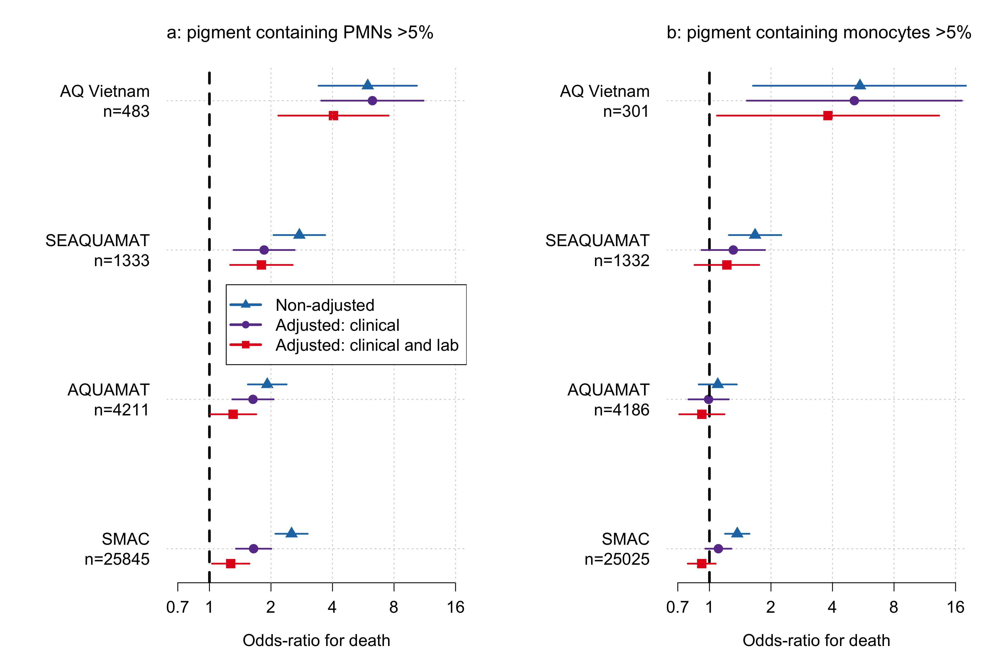<!-- -->


# Parasitaemia and pigment


```r
par(las=1, mfrow=c(2,2),family='serif',cex.lab=1.3, cex.axis=1.3)
plot(log10(pigmt_data$parasitaemia+lambda_para),
     jitter(log10(pigmt_data$prop_pigneut+lambda_pigment),
            amount = 0.02),ylab = 'Pigment containing PMNs (%)',
     xlab = 'Parasite density (per uL)', xlim = c(1.5,6.2),
     pch='.',xaxt='n', yaxt='n',panel.first=grid())
axis(2, at = log10(c(0,1,2,5,10,20,40)/100 +lambda_pigment), 
     labels = c(0,1,2,5,10,20,40))
axis(1, at = 2:6, labels = c(expression(10^2),
                             expression(10^3),
                             expression(10^4),
                             expression(10^5),
                             expression(10^6)))

abline(h = log10(0.05+lambda_pigment),lty=2,lwd=2, col='red')

mod = glmer(PMNs5 ~ log10(parasitaemia+lambda_para) + (1 |site:country:study), family='binomial', data = pigmt_data)
summary(mod)$coefficients
```

```
##                                     Estimate Std. Error   z value      Pr(>|z|)
## (Intercept)                       -5.5289872 0.25391632 -21.77484 4.018742e-105
## log10(parasitaemia + lambda_para)  0.8853594 0.02725899  32.47953 2.074645e-231
```

```r
xs = 10^(seq(1.5, 6, length.out = 100))

preds=predict(mod, newdata=data.frame(parasitaemia=xs,
                                      site = -1, country= -1, study= -1,
                                      lambda_para=lambda_para),
              type='response', allow.new.levels = T)
plot(log10(xs), preds, type='l',
     ylab = 'Pigment containing PMNs >5% (probability)',
     xlab = 'Parasite density (per uL)', xlim = c(1.5,6.2),
     xaxt='n', panel.first=grid(),lwd=3)
axis(1, at = 2:6, labels = c(expression(10^2),
                             expression(10^3),
                             expression(10^4),
                             expression(10^5),
                             expression(10^6)))

#### Monocytes
plot(log10(pigmt_data$parasitaemia+lambda_para),
     jitter(log10(pigmt_data$prop_pigmono+lambda_pigment),
            amount = 0.02),ylab = 'Pigment containing PMMs (%)',
     xlab = 'Parasite density (per uL)', xlim = c(1.5,6.2),
     pch='.',xaxt='n', yaxt='n',panel.first=grid())
axis(2, at = log10(c(0,1,2,5,10,20,40)/100 +lambda_pigment), 
     labels = c(0,1,2,5,10,20,40))
axis(1, at = 2:6, labels = c(expression(10^2),
                             expression(10^3),
                             expression(10^4),
                             expression(10^5),
                             expression(10^6)))

abline(h = log10(0.05+lambda_pigment),lty=2,lwd=2, col='red')

mod = glmer(PMMs5 ~ log10(parasitaemia+lambda_para) + (1 |site:country:study), family='binomial', data = pigmt_data)
summary(mod)$coefficients
```

```
##                                     Estimate Std. Error   z value      Pr(>|z|)
## (Intercept)                       -2.7481587 0.18483609 -14.86808  5.311094e-50
## log10(parasitaemia + lambda_para)  0.5150772 0.01613894  31.91519 1.643639e-223
```

```r
xs = 10^(seq(1.5, 6, length.out = 100))

preds=predict(mod, newdata=data.frame(parasitaemia=xs,site = -1, country= -1, study= -1, lambda_para=lambda_para),type='response', allow.new.levels = T)
plot(log10(xs), preds, type='l',
     ylab = 'Pigment containing PMMs >5% (probability)',
     xlab = 'Parasite density (per uL)', xlim = c(1.5,6.2),
     xaxt='n', panel.first=grid(),lwd=3)
axis(1, at = 2:6, labels = c(expression(10^2),
                             expression(10^3),
                             expression(10^4),
                             expression(10^5),
                             expression(10^6)))
```

<!-- -->

```r
par(mfrow=c(1,2))

mod = glmer(as.numeric(prop_pigneut>0) ~ log10(parasitaemia+lambda_para) + (1 |site:country:study), family='binomial', data = pigmt_data)
summary(mod)$coefficients
```

```
##                                     Estimate Std. Error   z value     Pr(>|z|)
## (Intercept)                       -2.3718346 0.24154917 -9.819262 9.302231e-23
## log10(parasitaemia + lambda_para)  0.7830075 0.01515935 51.651772 0.000000e+00
```

```r
preds=predict(mod, newdata=data.frame(parasitaemia=xs,site = -1, country= -1, study= -1, lambda_para=lambda_para),type='response', allow.new.levels = T)
plot(log10(xs), preds, type='l',
     ylab = 'Pigment containing PMNs >0% (probability)',
     xlab = 'Parasite density (per uL)', xlim = c(1.5,6.2),
     xaxt='n', panel.first=grid(),lwd=3)
axis(1, at = 2:6, labels = c(expression(10^2),
                             expression(10^3),
                             expression(10^4),
                             expression(10^5),
                             expression(10^6)))


mod = glmer(as.numeric(prop_pigmono>0) ~ log10(parasitaemia+lambda_para) + (1 |site:country:study), family='binomial', data = pigmt_data)
summary(mod)$coefficients
```

```
##                                     Estimate Std. Error   z value    Pr(>|z|)
## (Intercept)                       -2.0457954 0.15190085 -13.46796 2.41429e-41
## log10(parasitaemia + lambda_para)  0.6426988 0.01349885  47.61138 0.00000e+00
```

```r
preds=predict(mod, newdata=data.frame(parasitaemia=xs,site = -1, country= -1, study= -1, lambda_para=lambda_para),type='response', allow.new.levels = T)
plot(log10(xs), preds, type='l',
     ylab = 'Pigment containing PMMs >0% (probability)',
     xlab = 'Parasite density (per uL)', xlim = c(1.5,6.2),
     xaxt='n', panel.first=grid(),lwd=3)
axis(1, at = 2:6, labels = c(expression(10^2),
                             expression(10^3),
                             expression(10^4),
                             expression(10^5),
                             expression(10^6)))
```

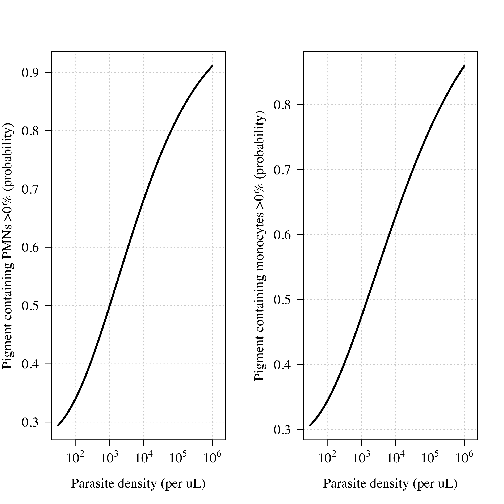<!-- -->


# Pigment and severe anaemia


```r
pigmt_data$SMA = as.numeric(pigmt_data$hb<5)
table(SMA=pigmt_data$SMA, study=pigmt_data$study)
```

```
##    study
## SMA    AQ AQUAMAT Lyke et al SEAQUAMAT  SMAC
##   0   457    2688        142      1168 20050
##   1    26    1158         24       100  5451
```

```r
par(las=1, mfrow=c(2,2))
plot(jitter(log10(pigmt_data$prop_pigneut[Af_ind]+lambda_pigment),amount = 0.05),xaxt='n',
     jitter(pigmt_data$hb[Af_ind],amount = 0.02),
     pch='.',ylim = c(2,13),
     ylab='Haemoglobin (g/dL)', xlab = 'Pigment contaning PMNs (%)')
axis(1, at = log10(c(0,1,2,5,10,20)/100 +lambda_pigment), 
     labels = c(0,1,2,5,10,20))
mod = gam(hb ~ s(log10(prop_pigneut+lambda_pigment),k=5),
          data = pigmt_data[Af_ind, ])
summary(mod)
```

```
## 
## Family: gaussian 
## Link function: identity 
## 
## Formula:
## hb ~ s(log10(prop_pigneut + lambda_pigment), k = 5)
## 
## Parametric coefficients:
##             Estimate Std. Error t value Pr(>|t|)    
## (Intercept)  7.36439    0.01557     473   <2e-16 ***
## ---
## Signif. codes:  0 '***' 0.001 '**' 0.01 '*' 0.05 '.' 0.1 ' ' 1
## 
## Approximate significance of smooth terms:
##                                           edf Ref.df     F p-value    
## s(log10(prop_pigneut + lambda_pigment)) 2.898  3.307 242.9  <2e-16 ***
## ---
## Signif. codes:  0 '***' 0.001 '**' 0.01 '*' 0.05 '.' 0.1 ' ' 1
## 
## R-sq.(adj) =  0.0266   Deviance explained = 2.67%
## GCV = 7.1549  Scale est. = 7.1539    n = 29510
```

```r
xs = (0: round(100*quantile(pigmt_data$prop_pigneut, 
                            probs = .99, na.rm = T)))/100
lines(log10(xs+lambda_pigment), 
      predict(mod, newdata=data.frame(prop_pigneut=xs,
                                      lambda_pigment=lambda_pigment)),
      lwd=3,col='red')


plot(jitter(log10(pigmt_data$prop_pigmono[Af_ind]+lambda_pigment),amount = 0.05),xaxt='n',
     jitter(pigmt_data$hb[Af_ind],amount = 0.02),
     pch='.',ylim = c(2,13),
     ylab='Haemoglobin (g/dL)', xlab = 'Pigment contaning PMMs (%)')
axis(1, at = log10(c(0,1,5,20,40)/100+lambda_pigment), 
     labels = c(0,1,5,20,40))
mod = gam(hb ~ s(log10(prop_pigmono+lambda_pigment),k=5)+
            s(country_f,bs='re'),
          data = pigmt_data[Af_ind, ])
summary(mod)
```

```
## 
## Family: gaussian 
## Link function: identity 
## 
## Formula:
## hb ~ s(log10(prop_pigmono + lambda_pigment), k = 5) + s(country_f, 
##     bs = "re")
## 
## Parametric coefficients:
##             Estimate Std. Error t value Pr(>|t|)    
## (Intercept)   7.3482     0.2332   31.52   <2e-16 ***
## ---
## Signif. codes:  0 '***' 0.001 '**' 0.01 '*' 0.05 '.' 0.1 ' ' 1
## 
## Approximate significance of smooth terms:
##                                            edf Ref.df     F p-value    
## s(log10(prop_pigmono + lambda_pigment))  3.669  3.913 504.1  <2e-16 ***
## s(country_f)                            11.753 12.000 146.0  <2e-16 ***
## ---
## Signif. codes:  0 '***' 0.001 '**' 0.01 '*' 0.05 '.' 0.1 ' ' 1
## 
## R-sq.(adj) =  0.145   Deviance explained = 14.6%
## GCV = 6.3152  Scale est. = 6.3116    n = 28668
```

```r
xs = (0: round(100*quantile(pigmt_data$prop_pigmono, 
                            probs = .99, na.rm = T)))/100
lines(log10(xs+lambda_pigment), 
      predict(mod, newdata=data.frame(prop_pigmono=xs,
                                      lambda_pigment=lambda_pigment,
                                      country_f= -1),
              exclude = 'country_f'),lwd=3,col='red')
```

```
## Warning in predict.gam(mod, newdata = data.frame(prop_pigmono = xs,
## lambda_pigment = lambda_pigment, : factor levels -1 not in original fit
```

```r
# SMA

mod = gam(SMA ~ s(log10(prop_pigneut+lambda_pigment),k=3)+
            s(country_f, bs='re'),
          family = 'binomial',
          data = pigmt_data[Af_ind, ])
summary(mod)
```

```
## 
## Family: binomial 
## Link function: logit 
## 
## Formula:
## SMA ~ s(log10(prop_pigneut + lambda_pigment), k = 3) + s(country_f, 
##     bs = "re")
## 
## Parametric coefficients:
##             Estimate Std. Error z value Pr(>|z|)    
## (Intercept)  -1.1394     0.1624  -7.017 2.26e-12 ***
## ---
## Signif. codes:  0 '***' 0.001 '**' 0.01 '*' 0.05 '.' 0.1 ' ' 1
## 
## Approximate significance of smooth terms:
##                                            edf Ref.df  Chi.sq p-value    
## s(log10(prop_pigneut + lambda_pigment))  1.961  1.998   43.57  <2e-16 ***
## s(country_f)                            11.582 12.000 1124.21  <2e-16 ***
## ---
## Signif. codes:  0 '***' 0.001 '**' 0.01 '*' 0.05 '.' 0.1 ' ' 1
## 
## R-sq.(adj) =  0.0441   Deviance explained = 4.38%
## UBRE = 0.019976  Scale est. = 1         n = 29510
```

```r
xs = (0: round(100*quantile(pigmt_data$prop_pigneut[Af_ind], 
                            probs = .99, na.rm = T)))/100
preds = predict(mod, newdata=data.frame(prop_pigneut=xs,
                                        lambda_pigment=lambda_pigment,
                                        country_f= -1),
                type='response',se.fit = T,exclude='country_f')
```

```
## Warning in predict.gam(mod, newdata = data.frame(prop_pigneut = xs,
## lambda_pigment = lambda_pigment, : factor levels -1 not in original fit
```

```r
plot(log10(xs+lambda_pigment),
     preds$fit,lwd=3,col='red',type='l',xaxt='n')
axis(1, at = log10(c(0,1,2,5,10,20)/100 +lambda_pigment), 
     labels = c(0,1,2,5,10,20))

mod = gam(SMA ~ s(log10(prop_pigmono+lambda_pigment),k=3)+
            s(country_f, bs='re'),
          family = 'binomial',
          data = pigmt_data[Af_ind, ])
summary(mod)
```

```
## 
## Family: binomial 
## Link function: logit 
## 
## Formula:
## SMA ~ s(log10(prop_pigmono + lambda_pigment), k = 3) + s(country_f, 
##     bs = "re")
## 
## Parametric coefficients:
##             Estimate Std. Error z value Pr(>|z|)    
## (Intercept)  -1.2299     0.1749   -7.03 2.06e-12 ***
## ---
## Signif. codes:  0 '***' 0.001 '**' 0.01 '*' 0.05 '.' 0.1 ' ' 1
## 
## Approximate significance of smooth terms:
##                                           edf Ref.df Chi.sq p-value    
## s(log10(prop_pigmono + lambda_pigment))  1.98      2  530.3  <2e-16 ***
## s(country_f)                            11.62     12  841.3  <2e-16 ***
## ---
## Signif. codes:  0 '***' 0.001 '**' 0.01 '*' 0.05 '.' 0.1 ' ' 1
## 
## R-sq.(adj) =  0.0586   Deviance explained = 6.11%
## UBRE = -0.0028473  Scale est. = 1         n = 28668
```

```r
xs = (0: round(100*quantile(pigmt_data$prop_pigmono[Af_ind], 
                            probs = .99, na.rm = T)))/100
preds = predict(mod, newdata=data.frame(prop_pigmono=xs,lambda_pigment=lambda_pigment,
                                        country_f= -1),
                type='response',se.fit = T,exclude='country_f')
```

```
## Warning in predict.gam(mod, newdata = data.frame(prop_pigmono = xs,
## lambda_pigment = lambda_pigment, : factor levels -1 not in original fit
```

```r
plot(log10(xs+lambda_pigment),
     preds$fit,lwd=3,col='red',type='l',xaxt='n')
axis(1, at = log10(c(0,1,2,5,10,20)/100 +lambda_pigment), 
     labels = c(0,1,2,5,10,20))
```

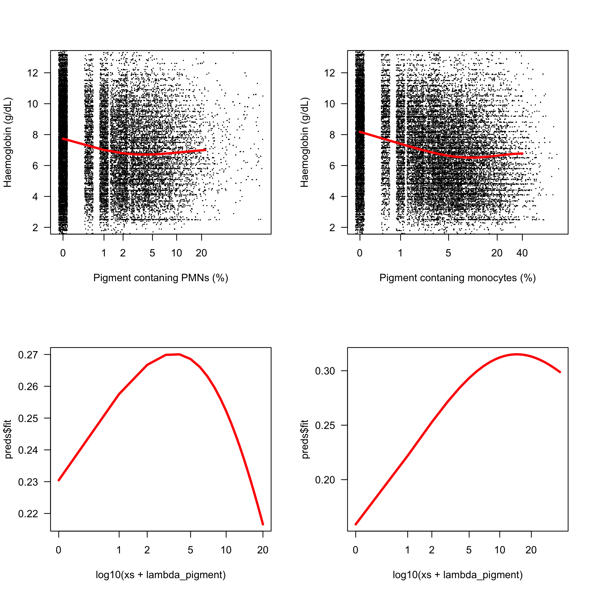<!-- -->


# HRP2 analysis - AQUAMAT

This can only be run with access to the HRP2 data

```r
hrp2_aq = read.csv('~/Dropbox/Datasets/AQUAMAT/AQM_childHRP2.csv')
pigmt_data = pigmt_data %>% filter(study == 'AQUAMAT')

pigmt_data$hrp2 = NA
for(i in 1:nrow(pigmt_data)){
  id = pigmt_data$id[i]
  if(id %in% hrp2_aq$studynumber){
    pigmt_data$hrp2[i] = hrp2_aq$hrp2_plasma[hrp2_aq$studynumber==id]
  }
}
```


```r
pigmt_data = 
  pigmt_data %>% filter(!is.na(hrp2),
                        !is.na(prop_pigneut) | !is.na(prop_pigmono))

pigmt_data$SM = as.numeric(pigmt_data$hrp2 >= 900)

sum(!is.na(pigmt_data$hrp2) & !is.na(pigmt_data$prop_pigneut))
```

```
## [1] 2933
```

```r
sum(!is.na(pigmt_data$hrp2) & !is.na(pigmt_data$prop_pigmono))
```

```
## [1] 2913
```

```r
mod=glmer(outcome ~ PMNs5 * SM + (1 | site:country), family='binomial', data = pigmt_data)
summary(mod)
```

```
## Generalized linear mixed model fit by maximum likelihood (Laplace
##   Approximation) [glmerMod]
##  Family: binomial  ( logit )
## Formula: outcome ~ PMNs5 * SM + (1 | site:country)
##    Data: pigmt_data
## 
##      AIC      BIC   logLik deviance df.resid 
##   1808.7   1838.6   -899.3   1798.7     2928 
## 
## Scaled residuals: 
##     Min      1Q  Median      3Q     Max 
## -0.5115 -0.3479 -0.3039 -0.2163  5.2942 
## 
## Random effects:
##  Groups       Name        Variance Std.Dev.
##  site:country (Intercept) 0.1567   0.3959  
## Number of obs: 2933, groups:  site:country, 9
## 
## Fixed effects:
##             Estimate Std. Error z value Pr(>|z|)    
## (Intercept) -2.73915    0.20351 -13.460   <2e-16 ***
## PMNs5        0.55588    0.29295   1.898   0.0578 .  
## SM           0.27060    0.17660   1.532   0.1254    
## PMNs5:SM     0.07874    0.32656   0.241   0.8095    
## ---
## Signif. codes:  0 '***' 0.001 '**' 0.01 '*' 0.05 '.' 0.1 ' ' 1
## 
## Correlation of Fixed Effects:
##          (Intr) PMNs5  SM    
## PMNs5    -0.346              
## SM       -0.577  0.417       
## PMNs5:SM  0.313 -0.888 -0.534
```


```r
ymax = quantile(pigmt_data$hrp2, probs = .995)
par(las = 1, mfrow=c(2, 2), mar = c(5,5,2,2), family='serif',cex.lab=1.3, cex.axis=1.3)
xs = jitter(log10(pigmt_data$prop_pigneut+lambda_pigment),amount = .02)
plot(xs,log10(pigmt_data$hrp2+1), xlim = c(-2.4, log10(0.4+lambda_pigment)),
     col = adjustcolor(c('blue','red')[pigmt_data$outcome+1],
                       alpha.f = c(.2)),
     pch=20, panel.first=grid(),ylim = log10(c(1, ymax)),
     yaxt = 'n', xaxt='n', ylab='PfHRP2 (ng/mL)',
     xlab = 'Pigment containing PMNs (%)')
axis(1, at = log10(c(0:2,5,10,20,40)/100 + lambda_pigment), labels = c(0:2,5,10,20,40))
axis(2, at = 0:4, labels = c(1,10,
                             expression(10^2),
                             expression(10^3),
                             expression(10^4)))
legend('bottomright', fill=adjustcolor(c('blue','red'),.5), inset = 0.03,
       legend = c('survived','died'))
abline(h = log10(1000), v = log10(0.05+lambda_pigment), lty=2)

xs = jitter(log10(pigmt_data$prop_pigmono+lambda_pigment),amount = .02)
plot(xs, log10(pigmt_data$hrp2+1), xlim = c(-2.4, log10(0.4+lambda_pigment)),
     col = adjustcolor(c('blue','red')[pigmt_data$outcome+1],
                       alpha.f = c(.2)),
     pch=20, panel.first=grid(),ylim = log10(c(1, ymax)),
     yaxt = 'n', xaxt='n', ylab='PfHRP2 (ng/mL)',
     xlab = 'Pigment containing PMMs (%)')
axis(1, at = log10(c(0,3,6,10,20,40)/100+lambda_pigment), labels = c(0,3,6,10,20,40))
axis(2, at = 0:4, labels = c(1,10,
                             expression(10^2),
                             expression(10^3),
                             expression(10^4)))
abline(h = log10(1000), v = log10(0.05+lambda_pigment), lty=2)


table(SM=pigmt_data$SM, PMNs_5percent=pigmt_data$PMNs5)
```

```
##    PMNs_5percent
## SM     0    1
##   0  814  149
##   1 1364  606
```

```r
table(SM=pigmt_data$SM, PMMs_5percent=pigmt_data$PMMs5)
```

```
##    PMMs_5percent
## SM     0    1
##   0  504  453
##   1  704 1252
```

```r
mod_PMN_hrp2 = glmer(SM ~ log10(prop_pigneut+lambda_pigment) + (1|country_f), family='binomial', data = pigmt_data)

mod_PMM_hrp2 = glmer(SM ~ log10(prop_pigmono+lambda_pigment) + (1|country_f), family='binomial', data = pigmt_data)

summary(mod_PMN_hrp2)$coefficients
```

```
##                                       Estimate Std. Error   z value    Pr(>|z|)
## (Intercept)                          2.1521650 0.23976452  8.976161 2.80378e-19
## log10(prop_pigneut + lambda_pigment) 0.9365987 0.08890105 10.535294 5.93971e-26
```

```r
summary(mod_PMM_hrp2)$coefficients
```

```
##                                       Estimate Std. Error  z value     Pr(>|z|)
## (Intercept)                          1.2778192 0.19644693 6.504653 7.787267e-11
## log10(prop_pigmono + lambda_pigment) 0.5059159 0.06245312 8.100730 5.463033e-16
```

```r
xs = (0:40)/100


preds_PMN = bootMer(mod_PMN_hrp2, nsim=200, 
                    FUN=function(x)predict(x, newdata=data.frame(prop_pigneut=xs,lambda_pigment=lambda_pigment), re.form=NA))


plot(log10(xs+lambda_pigment), 100*inv.logit(apply(preds_PMN$t,2,median)), 
     lwd=3, xaxt='n', xlab = 'Pigment containing PMNs (%)',
     ylab = 'PfHRP2>1000 ng/mL (%)', panel.first = grid(),
     ylim = c(0, 100),type='l')
axis(1, at = log10(c(0,1,2,5,10,20,40)/100 +lambda_pigment), 
     labels = c(0,1,2,5,10,20,40))
polygon(log10(c(xs, rev(xs))+lambda_pigment),
        100*inv.logit(c(apply(preds_PMN$t,2,quantile,probs=0.975),
                        rev(apply(preds_PMN$t,2,quantile,probs=0.025)))),
        col = adjustcolor('grey',.3), border = NA)


xs = (0:40)/100
preds_PMM = bootMer(mod_PMM_hrp2, nsim=200, 
                    FUN=function(x)predict(x, newdata=data.frame(prop_pigmono=xs,lambda_pigment=lambda_pigment), re.form=NA))

plot(log10(xs+lambda_pigment),100*inv.logit(apply(preds_PMM$t,2,median)),
     lwd=3, xaxt='n', xlab = 'Pigment containing PMMs (%)',
     ylab = 'PfHRP2>1000 ng/mL (%)', panel.first = grid(),
     ylim = c(0, 100),type='l')
axis(1, at = log10(c(0,3,6,10,20,40)/100 +lambda_pigment), 
     labels = c(0,3,6,10,20,40))
polygon(log10(c(xs, rev(xs))+lambda_pigment),
        100*inv.logit(c(apply(preds_PMM$t,2,quantile,probs=0.975),
                        rev(apply(preds_PMM$t,2,quantile,probs=0.025)))),
        col = adjustcolor('grey',.3), border = NA)
```

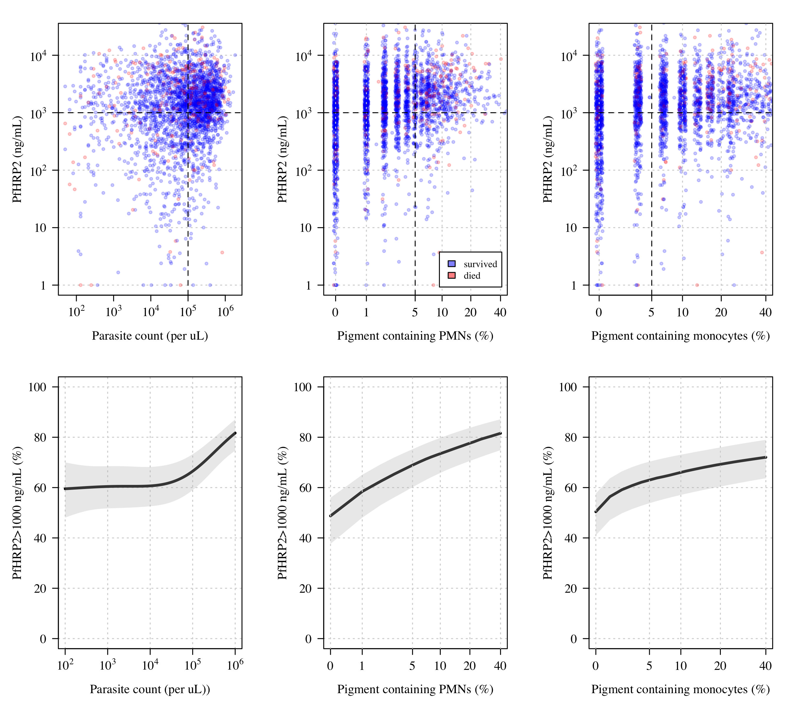<!-- -->


