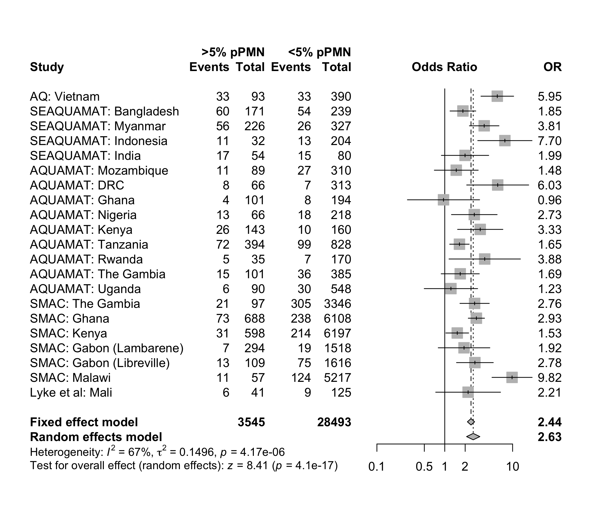

# Prognostic and diagnostic value of malaria pigment in severe malaria

The prognostic and diagnostic value of pigment containing leukocytes in severe malaria. We look at the proportion on pigment containing neutrophils and pigment containing monocytes separately. The analysis first looks at new data from MORU/OUCRU studies (AQ Vietnam, SEAQUAMAT, AQUAMAT) and then does a pooled individual patient data meta analysis combining with data from SMAC and a study in Mali (Lyke et al).

The bottom line: having >5% pigment containing neutrophils is highly predictive of mortality (odds ratio of about 2.7):

The estimated odds ratios for death are amazingly constant across these very different studies (substantial differences in mortality and study design). If we assume a baseline risk of death of 5% then an odds ratio of 2.7 equals a risk ratio of approx 2.5, implying a 12.5% mortality in the >5% pigment containing neutrophil group.
